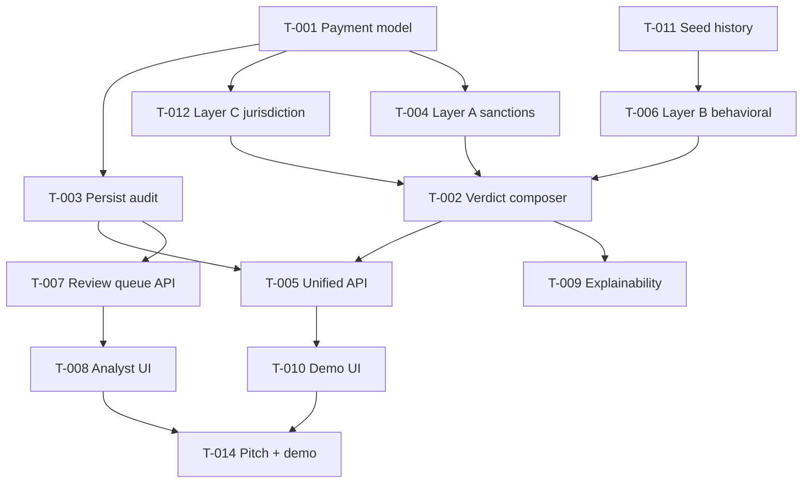

# Fiat AML Screening System — Priority Design Document

**Project:** Garaža FinTech AI Hackathon — Sokin sanctions screening challenge  
**Team:** Pavle Prodanović, Dositej Cvetković, Igor Antonijević  
**Date:** 2026-06-13  
**Status:** Approved direction — rebuild around full system, not matcher tuning  
**Scope:** Fiat payments only. Crypto wallet / graph screening explicitly **out of scope** for this sprint.

---

## 1. Executive summary

The hackathon problem is not "build a fuzzy name matcher." It is:

> Accept a **payment instruction**, assess **sanctions exposure and transaction risk**, return **MATCH / REVIEW / NO MATCH**, and operate as part of a **compliance system** with audit trail and human review.

### What we keep from current work

| Asset | Role going forward |
|-------|-------------------|
| OFAC SDN ingestion pipeline | Data layer — no rewrite |
| Normalized entity schema (`entities`, `entity_names`, …) | Watchlist source |
| Basic `ScreeningEngine` + matcher | Layer A implementation — frozen, not optimized |
| FastAPI + SQLite stack | Runtime foundation |
| A/B evaluation tooling | Internal QA only — not a demo surface |

### What we build next

A **payment screening gate** with parallel risk layers, persisted decisions, analyst workflow, and behavioral AML signals aligned with Sokin mentor context.

---

## 2. Product definition

### 2.1 Core user stories

| Actor | Story |
|-------|-------|
| **Payment system** | Submit a fiat payment instruction and receive a verdict in < 1s |
| **Compliance officer** | See why a payment was flagged, with list version and evidence |
| **AML analyst** | Clear REVIEW cases from a queue with enough context to decide in < 2 min |
| **Regulator (audit)** | Retrieve an immutable record of what was checked and why, months later |

### 2.2 Verdict semantics

| Verdict | Meaning | Downstream action |
|---------|---------|-------------------|
| **MATCH** | High-confidence sanctions hit | Block payment, notify compliance, log audit |
| **REVIEW** | Plausible hit or behavioral anomaly, not certain | Route to analyst queue, hold payment |
| **NO MATCH** | Clean on all layers checked | Release payment, log audit |

A payment can be **NO MATCH on sanctions** but **REVIEW on behavior** (and vice versa). A composer picks the strictest applicable verdict.

### 2.3 Architecture (target)

```
                    POST /screen
                         │
                         ▼
              ┌──────────────────────┐
              │   Payment Intake     │  Validate, normalize, extract parties
              └──────────┬───────────┘
                         │
         ┌───────────────┼───────────────┐
         ▼               ▼               ▼
  ┌─────────────┐ ┌─────────────┐ ┌─────────────┐
  │  Layer A    │ │  Layer B    │ │  Layer C    │
  │  Sanctions  │ │  Behavioral │ │  Jurisdiction│
  │  name match │ │  anomalies  │ │  risk       │
  └──────┬──────┘ └──────┬──────┘ └──────┬──────┘
         │               │               │
         └───────────────┼───────────────┘
                         ▼
              ┌──────────────────────┐
              │  Verdict Composer    │  MATCH > REVIEW > NO MATCH
              └──────────┬───────────┘
                         │
         ┌───────────────┼───────────────┐
         ▼               ▼               ▼
  ┌─────────────┐ ┌─────────────┐ ┌─────────────┐
  │ screening_  │ │ REVIEW      │ │ Post-MATCH  │
  │ results     │ │ queue       │ │ workflow    │
  │ (audit)     │ │ (analyst)   │ │ (notify)    │
  └─────────────┘ └─────────────┘ └─────────────┘
```

---

## 3. Scope boundaries

### In scope

- Rich fiat payment model (originator + beneficiary)
- Sanctions screening against OFAC SDN (existing data)
- Behavioral anomaly detection (seeded demo history)
- Jurisdiction / location risk signals
- Verdict composition across layers
- Immutable `screening_results` audit store
- Analyst REVIEW queue (API + minimal UI)
- Post-MATCH compliance workflow (mock notifications OK)
- Explainability in every verdict
- Demo UI for live screening
- Pitch narrative and demo script

### Out of scope (this sprint)

- Crypto wallet screening and on-chain graph analysis
- EU / UN / OFSI list ingestion
- Adverse media classifier
- Beneficial ownership / corporate registry graph
- PEP as separate list (may revisit as stretch)
- Matcher algorithm tuning, new A/B variants, embedding index
- Production deployment, multi-region sharding
- Real external integrations (SWIFT, core banking)

---

## 4. Data model additions

New tables on top of existing watchlist schema (`docs/design/data_model_and_ofac_ingestion.md`).

### 4.1 `payments`

One row per payment instruction submitted for screening.

| Column | Type | Description |
|--------|------|-------------|
| `id` | PK | Internal ID |
| `transaction_id` | text, unique | Client-supplied reference |
| `amount` | decimal | Payment amount |
| `currency` | text | ISO 4217 |
| `originator_name` | text | Sender legal name |
| `originator_country` | text | ISO 3166-1 alpha-2 |
| `originator_account` | text, nullable | IBAN / account number |
| `beneficiary_name` | text | Receiver legal name |
| `beneficiary_country` | text | ISO 3166-1 alpha-2 |
| `beneficiary_account` | text, nullable | IBAN / account number |
| `originator_bank_country` | text, nullable | Ordering bank jurisdiction |
| `beneficiary_bank_country` | text, nullable | Beneficiary bank jurisdiction |
| `countries_in_scope` | jsonb | All ISO countries touched |
| `purpose` | text, nullable | Remittance info / purpose code |
| `submitted_at` | timestamptz | When instruction arrived |
| `raw_payload` | jsonb | Original request verbatim |

### 4.2 `screening_results`

Append-only audit record. Never updated after insert (analyst decisions go to `analyst_decisions`).

| Column | Type | Description |
|--------|------|-------------|
| `id` | PK | UUID |
| `payment_id` | FK | Link to `payments` |
| `verdict` | text | MATCH \| REVIEW \| NO_MATCH |
| `confidence` | float | 0.0–1.0 composite score |
| `layers_executed` | jsonb | Per-layer scores, signals, latency |
| `list_versions` | jsonb | e.g. `{"OFAC_SDN": "2026-06-13", "publish_date": "..."}` |
| `engine_version` | text | Git SHA or semver |
| `explanation` | text | Human-readable summary |
| `matched_entity_ids` | jsonb | List of watchlist entity IDs hit |
| `screened_at` | timestamptz | Decision timestamp |
| `latency_ms` | int | End-to-end screening time |

### 4.3 `entity_transaction_history`

Seeded + appended transaction history per account for behavioral layer.

| Column | Type | Description |
|--------|------|-------------|
| `id` | PK | |
| `account_id` | text | Company / account identifier |
| `direction` | text | IN \| OUT |
| `amount` | decimal | |
| `currency` | text | |
| `counterparty_name` | text, nullable | |
| `counterparty_country` | text, nullable | |
| `executed_at` | timestamptz | |

### 4.4 `review_cases`

Queue entries for analyst workflow.

| Column | Type | Description |
|--------|------|-------------|
| `id` | PK | UUID |
| `screening_result_id` | FK | Source decision |
| `status` | text | PENDING \| BLOCKED \| RELEASED \| ESCALATED |
| `priority` | text | HIGH \| MEDIUM \| LOW (derived from confidence + amount) |
| `assigned_to` | text, nullable | Analyst ID |
| `created_at` | timestamptz | |
| `resolved_at` | timestamptz, nullable | |

### 4.5 `analyst_decisions`

| Column | Type | Description |
|--------|------|-------------|
| `id` | PK | |
| `review_case_id` | FK | |
| `analyst_id` | text | |
| `decision` | text | BLOCKED \| RELEASED \| ESCALATED |
| `reason` | text | Mandatory free text |
| `decided_at` | timestamptz | |
| `time_to_decide_s` | int, nullable | |

---

## 5. API surface (target)

| Method | Path | Priority | Description |
|--------|------|----------|-------------|
| `POST` | `/screen` | P0 | Screen a fiat payment instruction; persist result |
| `GET` | `/screen/{id}` | P0 | Retrieve screening result + audit detail |
| `GET` | `/review-queue` | P0 | List PENDING review cases |
| `GET` | `/review-queue/{id}` | P0 | Full case detail (payment + match + signals) |
| `POST` | `/review-queue/{id}/decide` | P0 | Analyst BLOCK / RELEASE / ESCALATE |
| `POST` | `/ingest/ofac-sdn` | P1 | Trigger list refresh (existing) |
| `GET` | `/audit` | P1 | Query screening history by date range |
| `POST` | `/screen/batch` | P2 | Batch re-screening |
| `GET` | `/health` | P0 | Liveness |

Single unified FastAPI app (merge `app/main.py` and `screening_api.py`).

---

## 6. Task backlog

Priority levels:

| Level | Meaning | Hackathon rule |
|-------|---------|----------------|
| **P0** | Must ship for credible demo | Non-negotiable |
| **P1** | Strong differentiator, ship if P0 done | High value |
| **P2** | Stretch / polish | Only if ahead of schedule |
| **P3** | Defer post-hackathon | Do not start |

Effort estimates for a single developer:

| Size | Hours |
|------|-------|
| S | 1–2h |
| M | 3–5h |
| L | 6–8h |

---

### P0 — Must ship

#### T-001 · Unified payment intake model

| Field | Value |
|-------|-------|
| **Priority** | P0 |
| **Effort** | M (3h) |
| **Owner** | Pavle |
| **Depends on** | — |
| **Blocks** | T-002, T-003, T-005, T-010 |

**Description:** Replace the single-field `Transaction` model with a `PaymentInstruction` schema: originator and beneficiary (name, country, optional account), amount, currency, bank countries, `countries_in_scope`, purpose, `raw_payload`.

**Acceptance criteria:**
- Pydantic model validates required fields
- Both parties screened independently in Layer A
- Backward-compatible adapter for old `{counterparty_name}` CLI calls

---

#### T-002 · Verdict composer (multi-layer)

| Field | Value |
|-------|-------|
| **Priority** | P0 |
| **Effort** | M (4h) |
| **Owner** | Pavle |
| **Depends on** | T-001, T-004, T-006 |
| **Blocks** | T-005, T-010 |

**Description:** Run Layer A (sanctions), Layer B (behavioral), Layer C (jurisdiction) in parallel. Merge into one `ScreeningResult` with per-layer breakdown. Rule: any layer MATCH → MATCH; else any REVIEW → REVIEW; else NO MATCH.

**Acceptance criteria:**
- `layers_executed` JSON shows each layer's verdict, score, and signals
- Composer latency logged end-to-end
- Unit tests for composition rules (sanctions MATCH + behavior clean → MATCH)

---

#### T-003 · Persist `payments` + `screening_results`

| Field | Value |
|-------|-------|
| **Priority** | P0 |
| **Effort** | M (4h) |
| **Owner** | Igor |
| **Depends on** | T-001 |
| **Blocks** | T-007, T-008, T-009, T-010 |

**Description:** SQLAlchemy models + migrations for `payments` and `screening_results`. Every `/screen` call writes both rows. Capture `list_versions` from `source_lists.last_published_at` at decision time. Append-only: no UPDATE on `screening_results`.

**Acceptance criteria:**
- `GET /screen/{id}` returns full persisted record
- `list_versions` and `engine_version` populated on every row
- `raw_payload` and `layers_executed` stored for audit

---

#### T-004 · Wire existing sanctions layer (Layer A)

| Field | Value |
|-------|-------|
| **Priority** | P0 |
| **Effort** | S (2h) |
| **Owner** | Dositej |
| **Depends on** | T-001 |
| **Blocks** | T-002 |

**Description:** Adapt existing `ScreeningEngine` to screen originator and beneficiary separately. Return structured `LayerResult` (not just final verdict). Include matched entity profile: primary name, aliases, programs, DOB, nationalities from DB. **Do not tune thresholds or matcher weights.**

**Acceptance criteria:**
- Both parties screened; highest-confidence hit wins for layer verdict
- `matched_entity_ids` reference real OFAC UIDs
- Layer returns signals array (method, score, detail) for explainability

---

#### T-005 · Unified FastAPI app

| Field | Value |
|-------|-------|
| **Priority** | P0 |
| **Effort** | S (2h) |
| **Owner** | Igor |
| **Depends on** | T-002, T-003 |
| **Blocks** | T-010 |

**Description:** Merge `app/main.py` (ingestion) and `screening_api.py` (screening) into one app. Single lifespan loads watchlist engine + DB session. Consistent logging middleware.

**Acceptance criteria:**
- One `uvicorn` entrypoint serves `/screen`, `/ingest/ofac-sdn`, `/health`
- OpenAPI docs reflect full surface
- No duplicate engine initialization

---

#### T-006 · Behavioral anomaly layer (Layer B)

| Field | Value |
|-------|-------|
| **Priority** | P0 |
| **Effort** | L (6h) |
| **Owner** | Dositej |
| **Depends on** | T-011 |
| **Blocks** | T-002 |

**Description:** Per Sokin mentor context. For a known `account_id`, compute:

1. **Amount anomaly** — z-score vs 90-day rolling avg/stddev; z > 3 → REVIEW
2. **Pass-through** — inbound ≈ outbound within 24h (ratio > 0.85) → REVIEW
3. **New counterparty** — first payment to this beneficiary → minor REVIEW signal

Return `LayerResult` with numeric scores and plain-English reason.

**Acceptance criteria:**
- Demo account with normal history + one anomalous payment triggers REVIEW with no sanctions hit
- Pass-through pattern detected on seeded data
- Unknown account (no history) returns NO_MATCH from behavior layer (no penalty)

---

#### T-007 · Review queue API

| Field | Value |
|-------|-------|
| **Priority** | P0 |
| **Effort** | M (4h) |
| **Owner** | Igor |
| **Depends on** | T-003 |
| **Blocks** | T-008, T-010 |

**Description:** When composer returns REVIEW, auto-create `review_cases` row. Endpoints: list pending cases (sorted by priority), get case detail (joins payment + screening_result + matched entity), submit analyst decision.

**Acceptance criteria:**
- REVIEW screenings appear in `GET /review-queue` within same request
- `POST /review-queue/{id}/decide` requires `reason` text
- Decision writes `analyst_decisions` row; updates case status
- MATCH verdicts do not create review cases (they go to post-MATCH workflow)

---

#### T-008 · Analyst review UI (minimal)

| Field | Value |
|-------|-------|
| **Priority** | P0 |
| **Effort** | L (6h) |
| **Owner** | Pavle |
| **Depends on** | T-007 |
| **Blocks** | T-014 |

**Description:** Single-page web UI (React or plain HTML/JS). Shows pending REVIEW cases. Per case: payment details, matched entity card (name, aliases, programs, DOB), signal breakdown by layer, explanation text. Actions: Block / Release / Escalate with mandatory reason modal.

**Acceptance criteria:**
- Analyst can clear a case end-to-end in the UI
- Entity profile shows raw OFAC fields from DB
- Works against local API without mock data

---

#### T-009 · Explainability in every verdict

| Field | Value |
|-------|-------|
| **Priority** | P0 |
| **Effort** | S (2h) |
| **Owner** | Dositej |
| **Depends on** | T-002, T-004 |
| **Blocks** | T-010, T-014 |

**Description:** Structured `explanation` field covering: which layers ran, what triggered the verdict, matched entity summary, recommended action. Not a one-liner — 2–4 sentences a compliance officer can read aloud.

**Acceptance criteria:**
- NO MATCH explanation states which lists were checked and that behavior was clean
- REVIEW explanation states *why* uncertain (e.g. "71% name similarity, DOB not provided")
- MATCH explanation cites entity name, list, and program

---

#### T-010 · Demo UI — payment screening

| Field | Value |
|-------|-------|
| **Priority** | P0 |
| **Effort** | M (5h) |
| **Owner** | Pavle |
| **Depends on** | T-005, T-008 |
| **Blocks** | T-014 |

**Description:** Simple form: submit a payment instruction, see verdict card with confidence, layer breakdown, explanation, link to audit record. Pre-loaded example buttons for demo script scenarios.

**Acceptance criteria:**
- Live demo: submit payment → verdict in < 2s
- Shows all three layer results visually
- "View in audit" links to persisted `screening_results` row

---

#### T-011 · Seed entity transaction history

| Field | Value |
|-------|-------|
| **Priority** | P0 |
| **Effort** | S (2h) |
| **Owner** | Dositej |
| **Depends on** | T-003 |
| **Blocks** | T-006 |

**Description:** Seed script creating 5–10 fictional B2B accounts with 30–90 days of realistic transaction history. Include one "normal" account, one pass-through launderer, one company due for amount spike demo.

**Acceptance criteria:**
- `python manage.py seed-history` populates `entity_transaction_history`
- Accounts referenced by `account_id` in payment instructions
- Documented in README with demo account IDs

---

#### T-014 · Demo script + pitch deck

| Field | Value |
|-------|-------|
| **Priority** | P0 |
| **Effort** | M (4h) |
| **Owner** | Pavle + Dositej |
| **Depends on** | T-008, T-010 |
| **Blocks** | — |

**Description:** 5-minute demo script covering: problem (fines, false positives), live scenarios, analyst queue, audit record. Pitch deck: Sokin B2B user, pain, solution, why system > point solution.

**Demo scenarios (minimum):**

| # | Scenario | Expected verdict |
|---|----------|------------------|
| 1 | Clean payment to "John Smith" GB | NO MATCH |
| 2 | Payment to transliterated sanctioned name | MATCH or REVIEW |
| 3 | Normal company, 50× usual amount | REVIEW (behavior) |
| 4 | Pass-through pattern account | REVIEW (behavior) |
| 5 | Analyst clears a REVIEW case live | Workflow |

**Acceptance criteria:**
- Rehearsed once end-to-end without failures
- Deck ≤ 10 slides
- Business narrative, not algorithm slides

---

### P1 — High value differentiators

#### T-012 · Jurisdiction risk layer (Layer C)

| Field | Value |
|-------|-------|
| **Priority** | P1 |
| **Effort** | S (2h) |
| **Owner** | Igor |
| **Depends on** | T-001 |
| **Blocks** | T-002 |

**Description:** Per mentor: company registered in US, payment order from high-risk country → elevated risk. Static risk tier map (config JSON): countries tagged HIGH / MEDIUM / LOW. Rules:

- Beneficiary country HIGH → REVIEW
- `originator_bank_country` mismatch with `originator_country` → REVIEW
- Any HIGH country in `countries_in_scope` → REVIEW

**Acceptance criteria:**
- Config file editable without code changes
- Layer C result appears in `layers_executed`
- Does not override sanctions MATCH

---

#### T-013 · Post-MATCH workflow

| Field | Value |
|-------|-------|
| **Priority** | P1 |
| **Effort** | S (2h) |
| **Owner** | Igor |
| **Depends on** | T-003 |
| **Blocks** | — |

**Description:** On MATCH verdict: create compliance event record, log "payment blocked", mock notify compliance team (console log or webhook stub). Surfaces in audit API.

**Acceptance criteria:**
- MATCH screening creates `compliance_events` row (or field on `screening_results`)
- `GET /screen/{id}` shows downstream action taken
- Demo can show "Compliance notified at 12:04:03"

---

#### T-015 · LLM case summary for REVIEW queue

| Field | Value |
|-------|-------|
| **Priority** | P1 |
| **Effort** | M (3h) |
| **Owner** | Dositej |
| **Depends on** | T-007, T-009 |
| **Blocks** | — |

**Description:** For REVIEW cases only, generate a 2–3 sentence analyst summary via Claude Haiku: what matched, what doesn't fit, recommended action. Stored on `review_cases.summary`. Satisfies "AI × finance" partner angle.

**Acceptance criteria:**
- Summary visible in review UI
- Fallback to template text if API unavailable
- Latency < 3s (async generation OK)

---

#### T-016 · Audit query API

| Field | Value |
|-------|-------|
| **Priority** | P1 |
| **Effort** | S (2h) |
| **Owner** | Igor |
| **Depends on** | T-003 |
| **Blocks** | — |

**Description:** `GET /audit?from=&to=&verdict=` returns screening history. `GET /audit/{transaction_id}` for regulator-style lookup. Read-only.

**Acceptance criteria:**
- Filter by date range and verdict
- Returns list versions and full explanation per record

---

#### T-017 · List refresh as product feature

| Field | Value |
|-------|-------|
| **Priority** | P1 |
| **Effort** | S (2h) |
| **Owner** | Igor |
| **Depends on** | T-005 |
| **Blocks** | — |

**Description:** Demo narrative for zero-downtime refresh: trigger ingest, show changelog (entities added/removed), confirm screening still works mid-refresh. Expose `GET /lists/status` with `last_fetched_at`, entity count, publish date.

**Acceptance criteria:**
- Status endpoint shows current list metadata
- Ingest result returns added/removed/deactivated counts
- Documented in demo script as 30-second segment

---

#### T-018 · Screen both parties with combined narrative

| Field | Value |
|-------|-------|
| **Priority** | P1 |
| **Effort** | S (2h) |
| **Owner** | Dositej |
| **Depends on** | T-004 |
| **Blocks** | — |

**Description:** Problem statement implies checking everyone on the payment. Explanation must say "originator: clean; beneficiary: REVIEW at 82%" when applicable.

**Acceptance criteria:**
- Separate sub-results for originator and beneficiary in Layer A
- Composer uses worst-case across parties

---

### P2 — Stretch

#### T-019 · Batch re-screening endpoint

| Field | Value |
|-------|-------|
| **Priority** | P2 |
| **Effort** | S (2h) |
| **Owner** | Igor |
| **Depends on** | T-005 |
| **Blocks** | — |

**Description:** `POST /screen/batch` accepts array of payments, returns array of results, persists each. Narrative: "lists updated daily, customers need re-screening."

---

#### T-020 · PEP as REVIEW tier (not MATCH)

| Field | Value |
|-------|-------|
| **Priority** | P2 |
| **Effort** | M (4h) |
| **Owner** | Dositej |
| **Depends on** | T-004 |
| **Blocks** | — |

**Description:** Wire existing `pep_loader.py` into a separate list. PEP hit → REVIEW (not MATCH), distinct from sanctions. Mentor notes PEP monitoring is standard.

---

#### T-021 · Account name vs transaction name check

| Field | Value |
|-------|-------|
| **Priority** | P2 |
| **Effort** | S (2h) |
| **Owner** | Pavle |
| **Depends on** | T-001 |
| **Blocks** | — |

**Description:** Mentor: account name must match name on transaction. Flag mismatch as REVIEW (VoP-lite story).

---

#### T-022 · SSE live queue updates

| Field | Value |
|-------|-------|
| **Priority** | P2 |
| **Effort** | S (2h) |
| **Owner** | Pavle |
| **Depends on** | T-008 |
| **Blocks** | — |

**Description:** Review UI auto-refreshes when new REVIEW cases arrive. Nice for demo, not required.

---

### P3 — Defer

| ID | Task | Reason |
|----|------|--------|
| T-030 | Crypto wallet screening | Explicitly out of scope |
| T-031 | EU / UN / OFSI ingestion | Time; OFAC sufficient for demo |
| T-032 | Adverse media | Needs external API + NLP pipeline |
| T-033 | Beneficial ownership graph | Needs corporate registry data |
| T-034 | Matcher tuning / A/B variants | User direction: not priority |
| T-035 | Embedding / FAISS index | Algorithm depth, not system gap |
| T-036 | Load / performance testing | No time; cite ~43ms benchmark anecdotally |

---

## 7. Suggested execution phases (~20h remaining)

### Phase 1 — Foundation (hours 0–6)

Parallel tracks:

| Owner | Tasks |
|-------|-------|
| **Pavle** | T-001 → T-002 (composer skeleton) |
| **Dositej** | T-011 → T-004 → T-009 |
| **Igor** | T-003 → T-005 |

**Gate:** `POST /screen` accepts rich payment, runs Layer A, persists audit row.

### Phase 2 — Risk layers + queue (hours 6–12)

| Owner | Tasks |
|-------|-------|
| **Pavle** | T-002 (complete) → T-008 |
| **Dositej** | T-006 → T-015 (if time) |
| **Igor** | T-007 → T-012 → T-013 |

**Gate:** Behavioral REVIEW works without sanctions hit. Analyst can decide a case via API.

### Phase 3 — Demo surfaces (hours 12–17)

| Owner | Tasks |
|-------|-------|
| **Pavle** | T-010 → T-014 |
| **Dositej** | T-018, support demo scenarios |
| **Igor** | T-016 → T-017 |

**Gate:** Full demo script runs live.

### Phase 4 — Buffer (hours 17–20)

- Rehearsal + bug fixes
- P2 picks if ahead: T-019 or T-020
- No matcher tuning

---

## 8. Dependency graph



---

## 9. Risk register

| Risk | Impact | Mitigation |
|------|--------|------------|
| Behavioral layer feels fake without history | Demo REVIEW scenario fails | T-011 seed script is P0, not optional |
| Scope creep into matcher tuning | Wastes hours, no judge value | Freeze Layer A; document as "existing engine" |
| Two FastAPI apps cause demo confusion | Broken live demo | T-005 in Phase 1 |
| Analyst UI takes too long | No human-in-the-loop story | T-008 is minimal HTML acceptable |
| LLM API down during demo | Missing AI angle | Template fallback in T-015 |
| Sanctions miss on demo name | Embarrassing live moment | Pre-validate demo scenarios; use names that work today |

---

## 10. Success criteria (hackathon done = all true)

- [ ] Submit a realistic B2B payment instruction via API or UI
- [ ] Receive MATCH / REVIEW / NO MATCH with multi-layer explanation
- [ ] REVIEW case appears in analyst queue and can be resolved with reason
- [ ] Every decision has a persisted, queryable audit record with list version
- [ ] Behavioral anomaly triggers REVIEW without any sanctions match
- [ ] 5-minute demo runs without manual DB hacks
- [ ] Pitch tells a system story, not an algorithm story

---

## 11. Document history

| Date | Change |
|------|--------|
| 2026-06-13 | Initial priority backlog. Fiat only. Crypto deferred. Matcher tuning out of scope. |
