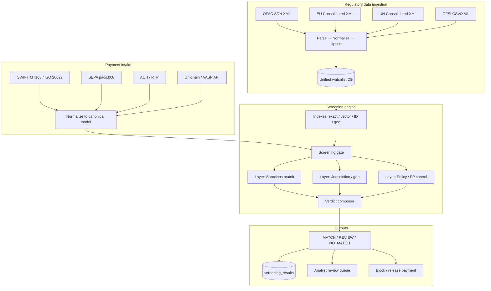
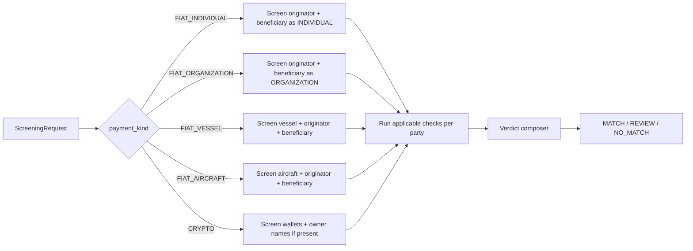

# Regulatory Data Pipeline, Transaction Models & Screening Checks

**Project:** TeslaFinTech / Garaža FinTech AI Hackathon  
**Status:** Design reference — canonical spec for ingestion, models, and validation  
**Date:** 2026-06-13  

This document describes:

1. How regulator-published data (OFAC and peers) is ingested into a unified watchlist model  
2. What real-world payment instructions look like, by party type  
3. Which screening checks apply to which fields  
4. How transaction models connect to watchlist data through the screening pipeline  

---

## 1. End-to-end system view



**Key idea:** Regulator data and payment data are **independent pipelines** that meet at the **screening gate**. Checks are field-to-field validators plus policy rules on top.

---

## 2. Regulatory data ingestion pipeline

### 2.1 Sources (starting set)

| Source | Format | Update cadence | Auth | Your status |
|--------|--------|----------------|------|-------------|
| **OFAC SDN** | XML (`sdn.xml`) | Daily | Free, no key | Ingested (`aml.db`) |
| **OFAC Consolidated** | XML | Daily | Free | Not yet |
| **EU Consolidated** | XML | Daily | Free | Not yet |
| **UN Consolidated** | XML | Free | Not yet |
| **OFSI (UK)** | CSV/XML | Daily | Free | Not yet |

All sources normalize into the **same schema** (`docs/design/data_model_and_ofac_ingestion.md`).

### 2.2 Ingestion stages

```text
Stage 1 — FETCH
  Download XML/CSV from regulator feed
  Record fetch timestamp, HTTP etag if available

Stage 2 — PARSE
  Walk list entries (OFAC: <sdnEntry>)
  Extract: uid, type, names, aliases, addresses, IDs, programs, DOB, nationalities
  Store full record in entities.raw (jsonb) for audit

Stage 3 — NORMALIZE
  Map regulator types → canonical entity_type:
    individual | entity | vessel | aircraft
  Split names into entity_names rows (primary + aka/fka/nka + quality)
  Classify identifications:
    passport, tax_id, registration, vessel_imo, wallet, metadata (gender, etc.)

Stage 4 — UPSERT
  Key: (source_list_id, source_uid)
  Update child tables (delete-and-reinsert per entity)
  Soft-delete: entities missing from new feed → is_active = false

Stage 5 — INDEX (for screening)
  Build runtime indexes from DB:
    - exact_name_hash (all entity_names.full_name normalized)
    - id_exact_hash (passport, tax_id, reg_no, wallet, vessel_id)
    - vector_index (embeddings of names) — optional
    - country_by_entity (nationalities + addresses)
    - phonetic_buckets (optional blocking)

Stage 6 — PUBLISH
  Update source_lists.last_fetched_at, last_published_at
  Expose GET /lists/status for audit trail
```

### 2.3 Unified watchlist model (regulator → DB)

Every list entry becomes a `SanctionedEntity` shape regardless of source:

| Watchlist field | DB table | Used in checks |
|-----------------|----------|----------------|
| Stable ID | `entities.source_uid` + `source_lists.code` | Audit, hit reference |
| Entity type | `entities.entity_type` | Type filter, check routing |
| Primary name | `entities.primary_name` | Name matching |
| Aliases | `entity_names` | Name matching (primary surface) |
| Alias quality | `entity_names.quality` | strong → MATCH candidate; weak → REVIEW cap |
| Addresses | `entity_addresses` | Geo corroboration |
| Nationalities / POB | `entity_nationalities` | Country boost / downgrade |
| DOB | `entity_dates_of_birth` | Confirm / reject individuals |
| Passports, national IDs | `entity_identifications` | Exact ID match |
| Tax / company reg | `entity_identifications` | Exact ID match (companies) |
| Vessel / aircraft IDs | `entity_identifications` | Exact match (maritime/aviation) |
| Wallet addresses | `entity_identifications` | Crypto exact match |
| Sanctions programs | `entity_programs` | Explainability, severity |
| Remarks, title | `entities.remarks`, `title` | Analyst context only |
| Full raw record | `entities.raw` | Audit snapshot |

### 2.4 What to be aware of (ingestion)

| Issue | Impact | Mitigation |
|-------|--------|------------|
| **OFAC puts metadata in `idList`** | `Gender`, `Secondary sanctions risk:` are not match keys | Whitelist `id_type` values for ID index |
| **Partial DOB** | `"circa 1965"`, year-only | Parse loosely; compare at year level only |
| **Country as text** | `"Russia"` not `RU` | ISO-3166 normalization table at match time |
| **40+ aliases per person** | Gaddafi, long org names | Index every `entity_names` row, not just primary |
| **Delistings** | Entity removed from feed | Soft-delete; never hard-delete (audit) |
| **Same person, multiple lists** | EU + OFAC + UN | Dedup by name+DOB later; for hackathon, tag `list_source` per hit |
| **Weak aliases** | OFAC `quality=weak` | Policy: never auto-MATCH on weak alias alone |
| **Vessel/aircraft in SDN** | Type-specific ID fields | Route to maritime/aviation checks |
| **List version** | Regulator asks "which list?" | Store `last_published_at` on every screening result |

---

## 3. Transaction models (real-world)

Payments arrive in different shapes. The screening engine accepts a **canonical `ScreeningRequest`** regardless of rail.

### 3.1 Shared primitives

```python
# ISO 3166-1 alpha-2 everywhere (normalize "Russia" → "RU" at intake)
# ISO 4217 currency codes
# Amounts as Decimal strings in JSON API

class Address(BaseModel):
    street: str | None = None
    city: str | None = None
    state_province: str | None = None
    postal_code: str | None = None
    country: str  # ISO-2 required if address present

class FinancialInstitution(BaseModel):
    bic: str | None = None           # SWIFT BIC 8 or 11
    name: str | None = None
    country: str                     # ISO-2
    routing_number: str | None = None  # ABA, Sort code, etc.

class RegulatoryReporting(BaseModel):
    country: str                     # ISO-2
    code: str
    info: str
```

### 3.2 Party types on the watchlist

OFAC (and peers) publish four entity types. Payments must declare which party shape is being screened:

| Watchlist `entity_type` | Payment `party_kind` | Typical payment context |
|-------------------------|----------------------|-------------------------|
| `individual` | `INDIVIDUAL` | Person sender/receiver |
| `entity` | `ORGANIZATION` | Company, NGO, government body |
| `vessel` | `VESSEL` | Maritime payment, shipping, oil |
| `aircraft` | `AIRCRAFT` | Aviation lease, charter, cargo |

---

### 3.3 Model A — Fiat payment with individual parties

**Real-world rails:** SWIFT MT103 (fields 50, 59), ISO 20022 `pacs.008` (Dbtr, Cdtr), SEPA, retail remittance.

**What is typically ON the wire:**

| Field | MT103 / ISO | Usually present? |
|-------|-------------|------------------|
| Originator name | Field 50 | Yes |
| Beneficiary name | Field 59 | Yes |
| Originator address | 50 | Often (country at minimum) |
| Beneficiary address | 59 | Often |
| Originator account | 50 | Yes |
| Beneficiary account | 59 | Yes |
| Amount + currency | 32A | Yes |
| Originator bank BIC | 52 | Yes |
| Beneficiary bank BIC | 57 | Yes |
| Remittance info | 70 | Sometimes |
| **Passport / DOB** | — | **Rare on wire** (lives in KYC) |

```python
class IndividualParty(BaseModel):
    party_kind: Literal["INDIVIDUAL"] = "INDIVIDUAL"
    full_name: str                   # Legal name as on account (required)
    name_aliases: list[str] = []     # Trading names, maiden name — if known from KYC
    account_number: str | None = None
    account_type: Literal["IBAN", "BBAN", "CLABE", "BBAN_US", "OTHER"] | None = None
    # --- KYC enrichment (optional, not on SWIFT message) ---
    national_id: str | None = None   # Passport or national ID number
    national_id_type: Literal["PASSPORT", "NATIONAL_ID", "TIN", "OTHER"] | None = None
    national_id_country: str | None = None  # ISO-2 issuing country
    date_of_birth: date | None = None
    # --- Address ---
    address: Address | None = None
    country_of_residence: str          # ISO-2 (required)
    # --- Internal ---
    customer_id: str | None = None     # Link to KYC profile
```

```python
class FiatIndividualTransaction(BaseModel):
    payment_kind: Literal["FIAT_INDIVIDUAL"] = "FIAT_INDIVIDUAL"
    transaction_id: str
    uetr: str | None = None            # ISO 20022 UUID end-to-end ref
    instruction_id: str | None = None
    end_to_end_id: str | None = None

    originator: IndividualParty
    beneficiary: IndividualParty

    originator_bank: FinancialInstitution
    beneficiary_bank: FinancialInstitution
    intermediary_bank: FinancialInstitution | None = None

    amount: Decimal
    currency: str                      # ISO 4217
    settlement_amount: Decimal | None = None
    settlement_currency: str | None = None

    value_date: date | None = None
    created_at: datetime
    submitted_at: datetime | None = None

    purpose_code: str | None = None    # SALA, SUPP, INTC, ...
    remittance_info: str | None = None
    regulatory_reporting: list[RegulatoryReporting] = []

    payment_rail: Literal["SWIFT", "SEPA", "ACH", "BACS", "CHAPS", "RTP", "OTHER"]
    priority: Literal["URGENT", "NORMAL", "BATCH"] = "NORMAL"

    countries_in_scope: list[str]      # Computed at intake: all ISO-2 touched
    raw_payload: dict = {}             # Original MT103 / pacs.008 verbatim
```

**Typical real-world example (B2B supplier payment via SWIFT):**

```json
{
  "payment_kind": "FIAT_INDIVIDUAL",
  "transaction_id": "TXN-2026-004821",
  "uetr": "a1b2c3d4-e5f6-7890-abcd-ef1234567890",
  "originator": {
    "party_kind": "INDIVIDUAL",
    "full_name": "Anna Petrova",
    "country_of_residence": "RU",
    "account_number": "GB29NWBK60161331926819",
    "account_type": "IBAN"
  },
  "beneficiary": {
    "party_kind": "INDIVIDUAL",
    "full_name": "Sergey Kuzhugetovich Shoygu",
    "country_of_residence": "RU",
    "account_number": "DE89370400440532013000",
    "account_type": "IBAN"
  },
  "originator_bank": { "bic": "NWBKGB2L", "name": "NatWest", "country": "GB" },
  "beneficiary_bank": { "bic": "COBADEFF", "name": "Commerzbank", "country": "DE" },
  "amount": "50000.00",
  "currency": "EUR",
  "payment_rail": "SWIFT",
  "countries_in_scope": ["GB", "RU", "DE"],
  "remittance_info": "Consulting services Q2"
}
```

Note: no passport, no DOB — **normal for SWIFT**.

---

### 3.4 Model B — Fiat payment with organization parties

**Real-world rails:** Same SWIFT/SEPA rails; corporate treasury, B2B cross-border (Sokin core use case).

**What is typically ON the wire:**

| Field | Usually present? |
|-------|------------------|
| Legal company name | Yes |
| Trading name | Rare on wire; sometimes in remittance |
| Company reg / tax ID | **Sometimes** from KYB, rarely on MT103 |
| Country of registration | Often (address country) |
| Account / IBAN | Yes |

```python
class OrganizationParty(BaseModel):
    party_kind: Literal["ORGANIZATION"] = "ORGANIZATION"
    legal_name: str                    # Full legal entity name (required)
    trading_names: list[str] = []      # DBA / brand names from KYB
    account_number: str | None = None
    account_type: Literal["IBAN", "BBAN", "BBAN_US", "OTHER"] | None = None
    # --- KYB enrichment (optional) ---
    registration_number: str | None = None
    registration_country: str | None = None   # ISO-2
    tax_id: str | None = None
    tax_id_country: str | None = None
    lei: str | None = None             # Legal Entity Identifier (20 char)
    organization_type: Literal[
        "PRIVATE_COMPANY", "PUBLIC_COMPANY", "GOVERNMENT",
        "NGO", "PARTNERSHIP", "TRUST", "OTHER"
    ] | None = None
    address: Address | None = None
    country_of_registration: str       # ISO-2 (required)
    customer_id: str | None = None
```

```python
class FiatOrganizationTransaction(BaseModel):
    payment_kind: Literal["FIAT_ORGANIZATION"] = "FIAT_ORGANIZATION"
    transaction_id: str
    uetr: str | None = None
    instruction_id: str | None = None

    originator: OrganizationParty
    beneficiary: OrganizationParty

    originator_bank: FinancialInstitution
    beneficiary_bank: FinancialInstitution
    intermediary_bank: FinancialInstitution | None = None

    amount: Decimal
    currency: str
    value_date: date | None = None
    created_at: datetime
    submitted_at: datetime | None = None

    purpose_code: str | None = None
    remittance_info: str | None = None
    payment_rail: Literal["SWIFT", "SEPA", "ACH", "BACS", "CHAPS", "RTP", "OTHER"]
    countries_in_scope: list[str]
    raw_payload: dict = {}
```

**Typical real-world example (Sokin-style B2B FX payment):**

```json
{
  "payment_kind": "FIAT_ORGANIZATION",
  "transaction_id": "TXN-2026-009102",
  "originator": {
    "party_kind": "ORGANIZATION",
    "legal_name": "Horizon Trading LLC",
    "country_of_registration": "US",
    "registration_number": "DE-1234567",
    "registration_country": "US",
    "account_number": "US12CHAS000012345678",
    "account_type": "BBAN_US"
  },
  "beneficiary": {
    "party_kind": "ORGANIZATION",
    "legal_name": "BREYELLER STAHL TECHNOLOGY GMBH & CO. KG",
    "country_of_registration": "DE",
    "account_number": "DE89370400440532013000",
    "account_type": "IBAN"
  },
  "originator_bank": { "bic": "CHASUS33", "country": "US" },
  "beneficiary_bank": { "bic": "COBADEFF", "country": "DE" },
  "amount": "230000.00",
  "currency": "USD",
  "payment_rail": "SWIFT",
  "countries_in_scope": ["US", "DE"],
  "purpose_code": "SUPP"
}
```

---

### 3.5 Model C — Fiat payment with vessel party

**Real-world context:** Maritime trade, shipping sanctions (common on OFAC SDN — 1,499 vessels in your DB).

**What is typically available:**

| Field | Source |
|-------|--------|
| Vessel name | Bill of lading, charter party, SWIFT remittance |
| IMO number | Shipping docs (strong identifier) |
| MMSI | AIS / maritime systems |
| Flag state | Vessel registry |
| Owner / operator company | Often screened separately as ORGANIZATION |

```python
class VesselParty(BaseModel):
    party_kind: Literal["VESSEL"] = "VESSEL"
    vessel_name: str                   # Required
    imo_number: str | None = None        # 7-digit IMO — strongest ID
    mmsi: str | None = None
    call_sign: str | None = None
    flag_country: str | None = None      # ISO-2
    owner_name: str | None = None        # Screen owner as ORGANIZATION too
    operator_name: str | None = None
```

```python
class FiatVesselTransaction(BaseModel):
    payment_kind: Literal["FIAT_VESSEL"] = "FIAT_VESSEL"
    transaction_id: str
    # Payer/payee are usually organizations; vessel is the screened subject
    originator: OrganizationParty | IndividualParty
    beneficiary: OrganizationParty | IndividualParty
    vessel: VesselParty                 # Subject of sanctions check

    amount: Decimal
    currency: str
    payment_rail: Literal["SWIFT", "OTHER"] = "SWIFT"
    countries_in_scope: list[str]
    remittance_info: str | None = None   # Often references vessel name
    created_at: datetime
    raw_payload: dict = {}
```

**Typical example:**

```json
{
  "payment_kind": "FIAT_VESSEL",
  "transaction_id": "TXN-VES-001",
  "originator": {
    "party_kind": "ORGANIZATION",
    "legal_name": "Global Shipping Partners Ltd",
    "country_of_registration": "AE"
  },
  "beneficiary": {
    "party_kind": "ORGANIZATION",
    "legal_name": "Port Services Co",
    "country_of_registration": "IR"
  },
  "vessel": {
    "party_kind": "VESSEL",
    "vessel_name": "ADRIATIC GLORY",
    "imo_number": "9321483",
    "flag_country": "PA"
  },
  "amount": "1200000.00",
  "currency": "USD",
  "countries_in_scope": ["AE", "IR", "PA"]
}
```

---

### 3.6 Model D — Fiat payment with aircraft party

**Real-world context:** 344 aircraft on OFAC SDN. Less common in generic fintech demo; relevant for aviation sanctions.

```python
class AircraftParty(BaseModel):
    party_kind: Literal["AIRCRAFT"] = "AIRCRAFT"
    aircraft_name: str | None = None
    tail_number: str | None = None       # Registration / MSN — primary ID
    manufacturer: str | None = None
    model: str | None = None
    registration_country: str | None = None  # ISO-2
    operator_name: str | None = None
    owner_name: str | None = None
```

```python
class FiatAircraftTransaction(BaseModel):
    payment_kind: Literal["FIAT_AIRCRAFT"] = "FIAT_AIRCRAFT"
    transaction_id: str
    originator: OrganizationParty | IndividualParty
    beneficiary: OrganizationParty | IndividualParty
    aircraft: AircraftParty

    amount: Decimal
    currency: str
    countries_in_scope: list[str]
    created_at: datetime
    raw_payload: dict = {}
```

---

### 3.7 Model E — Crypto transfer (VASP / on-chain)

**Real-world context:** FATF Travel Rule, exchange withdrawals, stablecoin corridors (Sokin Africa strategy). Included for completeness; team may defer implementation.

**What is typically available:**

| Field | Custodial VASP | Non-custodial wallet |
|-------|----------------|----------------------|
| Wallet address | Yes | Yes |
| Chain | Yes | Yes |
| Owner name | Travel Rule if ≥ threshold | Usually **missing** |
| Owner ID / DOB | Travel Rule | Missing |
| tx_hash | Yes | Yes |

```python
class CryptoParty(BaseModel):
    party_kind: Literal["CRYPTO_WALLET"] = "CRYPTO_WALLET"
    wallet_address: str
    chain: Literal[
        "BITCOIN", "ETHEREUM", "SOLANA", "TRON", "POLYGON", "OTHER"
    ]
    address_type: Literal["EOA", "CONTRACT", "MULTISIG", "EXCHANGE_DEPOSIT"] | None = None
    vasp_name: str | None = None
    vasp_did: str | None = None
    # Travel Rule (often null below ~$1000 / €1000)
    owner_name: str | None = None
    owner_national_id: str | None = None
    owner_dob: date | None = None
    owner_address: Address | None = None
    owner_entity_type: Literal["INDIVIDUAL", "ORGANIZATION"] | None = None
```

```python
class CryptoTransaction(BaseModel):
    payment_kind: Literal["CRYPTO"] = "CRYPTO"
    transaction_id: str
    tx_hash: str | None = None
    block_number: int | None = None

    originator: CryptoParty
    beneficiary: CryptoParty

    amount: Decimal
    asset: str                         # BTC, ETH, USDC, ...
    asset_contract: str | None = None  # ERC-20 contract
    usd_equivalent: Decimal | None = None

    submitted_at: datetime
    confirmed_at: datetime | None = None
    chain: str
    raw_payload: dict = {}
```

**Typical custodial example (Travel Rule populated):**

```json
{
  "payment_kind": "CRYPTO",
  "transaction_id": "CR-2026-5512",
  "tx_hash": "0xabc...",
  "originator": {
    "party_kind": "CRYPTO_WALLET",
    "wallet_address": "0xOrigin...",
    "chain": "ETHEREUM",
    "owner_name": "Jane Doe",
    "owner_entity_type": "INDIVIDUAL"
  },
  "beneficiary": {
    "party_kind": "CRYPTO_WALLET",
    "wallet_address": "0xBeneficiary...",
    "chain": "ETHEREUM",
    "owner_name": "Acme Corp",
    "owner_entity_type": "ORGANIZATION"
  },
  "amount": "25000.00",
  "asset": "USDC",
  "usd_equivalent": "25000.00",
  "chain": "ETHEREUM"
}
```

---

### 3.8 Unified screening request (all types)

```python
class ScreeningRequest(BaseModel):
    request_id: str                    # Idempotency key
    payment: (
        FiatIndividualTransaction
        | FiatOrganizationTransaction
        | FiatVesselTransaction
        | FiatAircraftTransaction
        | CryptoTransaction
    )
    screening_lists: list[str] = ["OFAC_SDN"]   # OFAC_SDN, EU_CONSOLIDATED, ...
    requested_at: datetime
    caller_system: str                 # e.g. "sokin-payment-core"
    # Optional KYC join — when wire lacks IDs but platform has them
    kyc_enrichment: dict | None = None
```

**Intake rule:** At API boundary, compute `countries_in_scope` from all parties, banks, flags, and addresses. Screening always receives this denormalized list.

---

## 4. Screening checks catalog

Each check validates **payment field(s)** against **watchlist field(s)** and returns a `CheckResult`:

```python
class CheckResult(BaseModel):
    check_id: str
    layer: Literal["SANCTIONS", "JURISDICTION", "POLICY"]
    party_ref: str                     # "originator" | "beneficiary" | "vessel" | ...
    field: str                           # which payment field was tested
    watchlist_field: str | None
    outcome: Literal["HIT", "NO_HIT", "INCONCLUSIVE", "SKIPPED"]
    confidence: float                    # 0.0 - 1.0
    match_type: str | None               # EXACT, VECTOR, PHONETIC, ID_EXACT, GEO, ...
    matched_entity_id: str | None
    evidence: dict
```

### 4.1 Check matrix — INDIVIDUAL

| Check ID | Payment field(s) | Watchlist field(s) | Technique | If hit | If absent on payment |
|----------|------------------|--------------------|-----------|--------|----------------------|
| `IND-ID-PASSPORT` | `national_id` (passport) | `entity_identifications` Passport | Exact normalized | MATCH | SKIPPED |
| `IND-ID-NATIONAL` | `national_id` | National ID No. | Exact | MATCH | SKIPPED |
| `IND-NAME-EXACT` | `full_name`, `name_aliases` | `entity_names.full_name` | Normalize → hash lookup | MATCH/REVIEW | — |
| `IND-NAME-VECTOR` | `full_name`, aliases | all names | Embedding cosine | MATCH/REVIEW | — |
| `IND-NAME-PHONETIC` | `full_name` | all names | Metaphone/Soundex tokens | REVIEW | — |
| `IND-NAME-COMPONENT` | first/last if parseable | `first_name`, `last_name` | Last exact + first rule | REVIEW | Fall back to full name |
| `IND-DOB` | `date_of_birth` | `entity_dates_of_birth` | Year/full compare | Confirm or NO_HIT | INCONCLUSIVE |
| `IND-COUNTRY` | `country_of_residence` | nationalities, addresses | ISO normalize + overlap | Boost/downgrade | INCONCLUSIVE |
| `IND-ADDRESS` | `address` | `entity_addresses` | Country exact; city fuzzy | Corroboration only | SKIPPED |
| `IND-TYPE` | `party_kind` | `entity_type` | individual ↔ individual | Filter | — |
| `IND-COMMON-NAME` | `full_name` | — | Token frequency policy | Cap at REVIEW | — |

### 4.2 Check matrix — ORGANIZATION

| Check ID | Payment field(s) | Watchlist field(s) | Technique | If hit | If absent |
|----------|------------------|--------------------|-----------|--------|-----------|
| `ORG-ID-TAX` | `tax_id` | Tax ID No. | Exact | MATCH | SKIPPED |
| `ORG-ID-REG` | `registration_number` | Registration Number, Company Number | Exact | MATCH | SKIPPED |
| `ORG-ID-LEI` | `lei` | Identification Number | Exact | MATCH | SKIPPED |
| `ORG-NAME-EXACT` | `legal_name`, `trading_names` | `entity_names` | Normalize + strip suffix | MATCH/REVIEW | — |
| `ORG-NAME-VECTOR` | `legal_name` | all names | Embedding | MATCH/REVIEW | — |
| `ORG-GENERIC-TOKEN` | `legal_name` | — | Penalize TRADING, GROUP, etc. | Cap at REVIEW | — |
| `ORG-COUNTRY` | `country_of_registration` | addresses | ISO overlap | Boost/downgrade | — |
| `ORG-TYPE` | `party_kind` | `entity_type` | entity ↔ ORGANIZATION | Filter mismatches | — |

### 4.3 Check matrix — VESSEL

| Check ID | Payment field(s) | Watchlist field(s) | Technique | If hit |
|----------|------------------|--------------------|-----------|--------|
| `VES-ID-IMO` | `imo_number` | Vessel Registration / IMO | Exact | MATCH |
| `VES-ID-MMSI` | `mmsi` | MMSI | Exact | MATCH |
| `VES-NAME-EXACT` | `vessel_name` | `entity_names` (type=vessel) | Exact normalized | MATCH/REVIEW |
| `VES-NAME-VECTOR` | `vessel_name` | vessel names | Embedding | REVIEW |
| `VES-FLAG` | `flag_country` | addresses, remarks | Geo corroboration | Boost/downgrade |
| `VES-OWNER` | `owner_name` | org/individual names | Run ORG/IND checks on owner | Separate hits |

### 4.4 Check matrix — AIRCRAFT

| Check ID | Payment field(s) | Watchlist field(s) | Technique | If hit |
|----------|------------------|--------------------|-----------|--------|
| `ACF-ID-TAIL` | `tail_number` | identifications | Exact | MATCH |
| `ACF-NAME` | `aircraft_name` | `entity_names` (type=aircraft) | Exact / vector | MATCH/REVIEW |
| `ACF-OPERATOR` | `operator_name` | names | ORG/IND pipeline | Separate hits |

### 4.5 Check matrix — CRYPTO

| Check ID | Payment field(s) | Watchlist field(s) | Technique | If hit |
|----------|------------------|--------------------|-----------|--------|
| `CRY-WALLET-EXACT` | `wallet_address` | Digital Currency Address - * | Exact (case-normalized) | MATCH |
| `CRY-OWNER-NAME` | `owner_name` | `entity_names` | IND/ORG name pipeline | If Travel Rule present |
| `CRY-GRAPH-HOP` | `wallet_address` | on-chain + wallet list | Graph traversal | REVIEW (stretch) |

### 4.6 Check matrix — PAYMENT-LEVEL (all fiat types)

| Check ID | Payment field(s) | Watchlist | Technique | Effect |
|----------|------------------|-----------|-----------|--------|
| `PAY-COUNTRIES-SCOPE` | `countries_in_scope` | entity countries, program regions | Set overlap | Jurisdiction REVIEW |
| `PAY-BANK-COUNTRY` | bank countries | high-risk config | Static risk tiers | Jurisdiction REVIEW |
| `PAY-REMITTANCE` | `remittance_info` | `entities.remarks`, names | Keyword / optional vector | Weak corroboration only |
| `PAY-REG-REPORTING` | `regulatory_reporting` | — | Country-specific rules | Future / demo skip |

### 4.7 Policy layer (not field match — applied after checks)

| Policy ID | Condition | Effect |
|-----------|-----------|--------|
| `POL-COMMON-NAME` | `is_common_name(name)` and no ID/DOB confirm | Max verdict REVIEW |
| `POL-WEAK-ALIAS` | hit on `quality=weak` only | Max verdict REVIEW |
| `POL-DOB-CONFLICT` | name hit + year mismatch | NO_MATCH or REVIEW |
| `POL-COUNTRY-CONFLICT` | name hit + country mismatch | Downgrade to REVIEW / NO_MATCH |
| `POL-TYPE-MISMATCH` | individual payment vs entity list hit | Downgrade |
| `POL-GENERIC-ORG` | org name with only generic tokens | Max REVIEW |
| `POL-MULTI-PARTY` | originator + beneficiary + vessel | Final = strictest party verdict |

---

## 5. How models and checks connect

### 5.1 Routing: payment_kind → parties to screen



### 5.2 Per-party check execution order

For each party, run checks **cheapest first, exit early on strong hits:**

```text
1. SKIPPED checks (field missing) — log, continue
2. ID exact checks (passport, tax_id, IMO, wallet) — HIT → candidate MATCH
3. Name exact (all aliases, normalized) — HIT → candidate MATCH/REVIEW
4. Name vector / phonetic — score → candidate MATCH/REVIEW
5. DOB / country corroboration — adjust score
6. Policy layer — cap or downgrade verdict
7. Emit CheckResult[] for audit
```

### 5.3 Verdict composer rules

```text
Per party:
  IF any ID_EXACT hit on strong identifier     → party_verdict = MATCH
  ELIF name score ≥ MATCH_THRESHOLD
       AND NOT policy_blocked                  → party_verdict = MATCH
  ELIF name score ≥ REVIEW_THRESHOLD
       OR jurisdiction REVIEW
       OR policy caps to REVIEW                → party_verdict = REVIEW
  ELSE                                         → party_verdict = NO_MATCH

Payment-level:
  final_verdict = strictest(originator, beneficiary, vessel, aircraft, ...)
  MATCH > REVIEW > NO_MATCH

confidence = f(best_hit_score, corroboration_count, policy_penalties)
```

### 5.4 Field availability by rail (what actually runs)

Typical **SWIFT B2B corporate** payment — checks that **run** vs **skip**:

| Check | Originator | Beneficiary |
|-------|------------|-------------|
| IND/ORG-NAME-EXACT | Run | Run |
| IND/ORG-NAME-VECTOR | Run | Run |
| IND/ORG-COUNTRY | Run | Run |
| IND-ID-PASSPORT | Skip | Skip |
| IND-DOB | Skip | Skip |
| ORG-ID-REG | Skip* | Skip* |
| PAY-COUNTRIES-SCOPE | Run | Run |

\*Unless `kyc_enrichment` or KYB profile attached to request.

### 5.5 KYC enrichment pattern

Real platforms join onboarding data before screening:

```json
{
  "payment": { "...": "FiatOrganizationTransaction without tax_id" },
  "kyc_enrichment": {
    "beneficiary": {
      "tax_id": "123456789",
      "tax_id_country": "DE",
      "verified_at": "2025-11-01"
    }
  }
}
```

Engine merges enrichment into party before checks → `ORG-ID-TAX` runs instead of SKIPPED.

---

## 6. Screening output model

```python
class ScreeningHit(BaseModel):
    matched_entity_id: str             # e.g. "OFAC_SDN:35096"
    matched_entity_name: str
    list_source: str
    entity_type: str                   # individual | entity | vessel | aircraft
    match_type: str                    # EXACT | VECTOR | ID_EXACT | PHONETIC | GEO
    match_field: str                   # payment field that triggered hit
    watchlist_field: str
    similarity_score: float
    programs: list[str] = []
    evidence: dict

class ScreeningVerdict(BaseModel):
    request_id: str
    transaction_id: str
    verdict: Literal["MATCH", "REVIEW", "NO_MATCH"]
    confidence: float
    latency_ms: int

    payment_kind: str
    parties_screened: list[str]        # ["originator", "beneficiary"]
    checks_executed: list[CheckResult]
    hits: list[ScreeningHit]

    explanation: str
    lists_checked: list[str]
    list_versions: dict[str, str]      # {"OFAC_SDN": "2026-06-11"}
    engine_version: str
    checked_at: datetime

    # Persisted verbatim for regulators
    payment_snapshot: dict
    recommended_action: str            # BLOCK | HOLD_FOR_REVIEW | RELEASE
```

---

## 7. Awareness checklist (design + ops)

### 7.1 Data / ingestion

- [ ] Normalize countries at ingestion **and** at screening (`RU` ↔ `Russia`)
- [ ] Index all aliases, not only `primary_name`
- [ ] Filter non-ID rows out of ID index (`Gender`, `Secondary sanctions risk:`)
- [ ] Store `list_versions` on every screening result
- [ ] Soft-delete delisted entities; keep for historical audit queries

### 7.2 Matching / false positives

- [ ] Never auto-MATCH on common personal names (`Mohammed`, `Kim`, `Smith`) without corroboration
- [ ] Never auto-MATCH on generic org tokens (`Trading`, `International`, `Group`) without full name + country
- [ ] Weak OFAC aliases → REVIEW cap
- [ ] DOB conflict → downgrade or NO_MATCH
- [ ] Screen **both** originator and beneficiary (source of funds / third-party risk)

### 7.3 Real-world payment gaps

- [ ] Passport and DOB usually absent on wire — design for SKIPPED, not failure
- [ ] Company reg/tax ID may come from KYB — support `kyc_enrichment`
- [ ] `countries_in_scope` must include **bank countries**, not only party countries
- [ ] Vessel/aircraft payments are niche but OFAC has thousands — support type routing

### 7.4 Regulatory narrative

- [ ] Every verdict has human-readable `explanation`
- [ ] `checks_executed` shows what was tested, including SKIPPED fields
- [ ] REVIEW routes to analyst queue with full entity profile from `raw`
- [ ] MATCH triggers block + compliance notification (even if mocked)

---

## 8. Minimal implementation mapping (this repo)

| Document concept | Current code | Gap |
|------------------|--------------|-----|
| Unified watchlist | `app/models.py`, `aml.db` | Add EU/UN when ready |
| OFAC ingest | `app/ingestion/ofac_sdn.py` | Consolidated list |
| Payment model | `screening/models.Transaction` (stub) | Replace with models in §3 |
| Checks | `screening/engine.py`, `matcher.py` | Split into check modules per party type |
| Verdict + audit | In-memory `ScreeningResult` | Persist `screening_results` |
| Review queue | Not built | §5.3 downstream |

---

## 9. Document history

| Date | Change |
|------|--------|
| 2026-06-13 | Initial spec: ingestion pipeline, all payment kinds, check catalog, model-check wiring |
