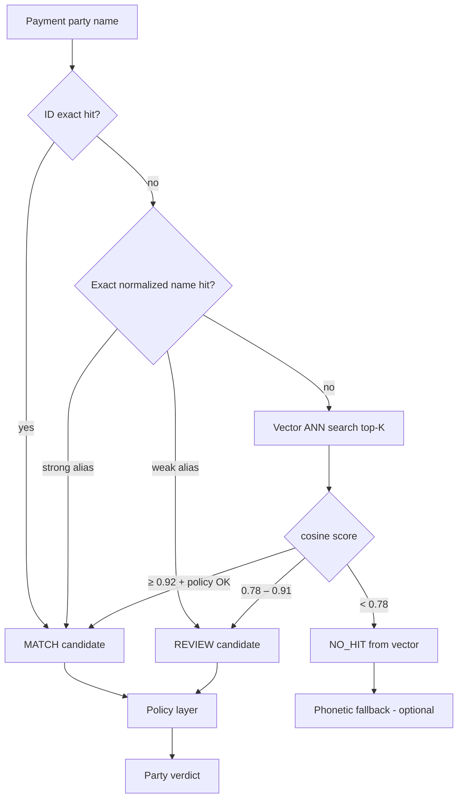

# Vector Search — Implementation Plan

**Project:** TeslaFinTech sanctions screening  
**Status:** Plan — ready for implementation  
**Date:** 2026-06-13  
**Parent docs:** [`screening_pipeline_and_models.md`](screening_pipeline_and_models.md), [`data_model_and_ofac_ingestion.md`](data_model_and_ofac_ingestion.md)

---

## 1. Purpose

Add **embedding-based name search** as the transliteration layer in the sanctions screening pipeline. Vector search catches name variants that are **not** listed as OFAC aliases (e.g. `Vladimir Poutine` → `Vladimir PUTIN`) without relying on fuzzy string ratios.

### Goals

- Embed all watchlist names from `entity_names` (~43k rows today)
- At screening time: embed payment name → top-K ANN search → cosine score → MATCH / REVIEW / NO_MATCH
- Integrate as check `IND-NAME-VECTOR` / `ORG-NAME-VECTOR` in existing pipeline (after exact ID + exact name)
- Rebuild index when OFAC list is re-ingested
- Record vector evidence in screening audit (`match_type: VECTOR`, similarity, model version)

### Non-goals (this plan)

- Replacing exact alias lookup (vectors run **after** exact)
- Vector search on addresses, remarks, or remittance text
- Milvus server deployment (use in-process FAISS for hackathon)
- Fine-tuning embedding models
- Crypto wallet matching (exact only)
- Behavioral / jurisdiction layers

---

## 2. Position in screening pipeline



**Rule:** If exact name lookup returns **MATCH**, skip vector search (save latency).

---

## 3. Data source

### 3.1 What gets embedded

One embedding per row in `entity_names`:

| Column | Use |
|--------|-----|
| `full_name` | **Text to embed** (primary) |
| `entity_id` | Link to `entities` for metadata |
| `id` | Stable `name_id` in index |
| `name_type` | `primary` / `aka` / `fka` / `nka` |
| `quality` | `strong` / `weak` — used in policy, not in embedding |
| `entities.entity_type` | `individual` / `entity` / `vessel` / `aircraft` — optional ANN filter |
| `entities.source_uid` | Hit ID: `OFAC_SDN:{uid}` |

**Do not embed:** `entity_identifications` metadata rows (`Gender`, `Secondary sanctions risk:`).

### 3.2 Current scale (`aml.db`)

| Metric | Value |
|--------|-------|
| Active entities | 19,065 |
| Name rows | 43,705 |
| Individuals | 7,481 |
| Organizations | 9,741 |
| Vessels | 1,499 |
| Aircraft | 344 |

FAISS in-process handles this easily (&lt;50ms build query, &lt;15ms search).

### 3.3 Query texts (payment side)

For each party, embed **every** name string provided:

| Party kind | Fields to embed |
|------------|-----------------|
| Individual | `full_name`, each `name_aliases[]` |
| Organization | `legal_name`, each `trading_names[]` |
| Vessel | `vessel_name` |
| Aircraft | `aircraft_name` |
| Crypto (if owner known) | `owner_name` |

Take **max similarity** across all query embeddings.

---

## 4. Embedding model

### 4.1 Recommended model

| Option | Model | Pros | Cons |
|--------|-------|------|------|
| **A (recommended)** | `sentence-transformers/paraphrase-multilingual-mpnet-base-v2` | Multilingual, Cyrillic/Arabic/Latin, 768-dim, well-tested for names | ~1.1GB download, ~100ms encode cold |
| B | `sentence-transformers/all-MiniLM-L6-v2` | Fast, small | Weaker on transliteration |
| C | `intfloat/multilingual-e5-small` | Good multilingual, smaller | Different prompt format (`query:` / `passage:`) |

**Pick A** for sanctions transliteration quality.

### 4.2 Encoding rules

```python
def encode_name(text: str, model) -> np.ndarray:
  # Normalize lightly before embed (keep original for audit)
  cleaned = strip_extra_whitespace(text)
  # No aggressive lowercasing — model handles case
  # Optional: prepend for e5 models only: f"query: {cleaned}"
  return model.encode(cleaned, normalize_embeddings=True)  # unit vector → cosine = dot product
```

**Batch at index build:** encode 256–512 names per batch for speed.

### 4.3 Dependencies to add

```text
# backend/requirements.txt
sentence-transformers>=3.0.0
faiss-cpu>=1.8.0
numpy>=1.26.0
```

Use `faiss-cpu` unless GPU available. No Milvus for hackathon scope.

---

## 5. Index design

### 5.1 Artifact layout

```text
backend/data/
  aml.db                          # source of truth
  indexes/
    names.faiss                     # FAISS index (IndexFlatIP or HNSW)
    names.meta.json                 # metadata parallel array
    names.manifest.json             # versions, build time, counts
```

### 5.2 `names.meta.json` (one entry per FAISS row, same order as index)

```json
{
  "row": 0,
  "name_id": 12847,
  "entity_id": 9032,
  "entity_ref": "OFAC_SDN:35096",
  "entity_type": "individual",
  "full_name": "Vladimir PUTIN",
  "name_type": "aka",
  "quality": "strong",
  "source_list": "OFAC_SDN"
}
```

### 5.3 `names.manifest.json`

```json
{
  "built_at": "2026-06-13T15:00:00Z",
  "source_list_publish_date": "06/11/2026",
  "embedding_model": "paraphrase-multilingual-mpnet-base-v2",
  "embedding_dim": 768,
  "name_count": 43705,
  "faiss_index_type": "IndexFlatIP",
  "git_sha": "abc123"
}
```

### 5.4 FAISS index type

| Type | When |
|------|------|
| **IndexFlatIP** | **Default** — 43k vectors, exact inner product, simplest, &lt;10ms |
| IndexHNSWFlat | If list grows to 500k+ |

Vectors are L2-normalized → inner product = cosine similarity.

### 5.5 Build command

```bash
cd backend
python manage.py build-name-index          # reads aml.db → writes data/indexes/*
python manage.py build-name-index --force  # rebuild after fetch
```

Hook: call after `python manage.py fetch` (optional flag `--rebuild-index`).

---

## 6. Search algorithm

### 6.1 Query steps

```python
def vector_name_check(
    query_names: list[str],
    *,
    entity_type_filter: str | None,
    country: str | None,
    top_k: int = 20,
) -> VectorCheckResult:
    best: VectorHit | None = None

    for query in query_names:
        q_vec = embed(query)
        scores, indices = index.search(q_vec, top_k)

        for score, idx in zip(scores[0], indices[0]):
            if idx < 0:
                continue
            meta = metadata[idx]
            if entity_type_filter and meta.entity_type != entity_type_filter:
                continue

            hit = VectorHit(
                query=query,
                matched_name=meta.full_name,
                entity_ref=meta.entity_ref,
                cosine=float(score),
                name_type=meta.name_type,
                quality=meta.quality,
            )
            if best is None or hit.cosine > best.cosine:
                best = hit

    if best is None or best.cosine < REVIEW_THRESHOLD:
        return VectorCheckResult(outcome="NO_HIT")

    adjusted = apply_country_adjustment(best, country)
    adjusted = apply_common_name_cap(adjusted)

    return VectorCheckResult(outcome="HIT", hit=adjusted)
```

### 6.2 Thresholds (initial — tune on benchmark)

| Cosine similarity | Raw verdict | After policy |
|-------------------|-------------|--------------|
| ≥ **0.92** | MATCH candidate | Cap to REVIEW if `is_common_name` or `quality=weak` |
| **0.78 – 0.91** | REVIEW | — |
| &lt; **0.78** | NO_HIT | — |

Store thresholds in config:

```python
# backend/screening/config.py
VECTOR_MATCH_THRESHOLD = 0.92
VECTOR_REVIEW_THRESHOLD = 0.78
VECTOR_TOP_K = 20
```

### 6.3 Score adjustments (after ANN)

| Signal | Adjustment |
|--------|------------|
| Country matches `entity_nationalities` / addresses | +0.03 (cap 1.0) |
| Country conflicts | −0.08 or force REVIEW cap |
| `is_common_name(query)` | max verdict REVIEW even if score ≥ 0.92 |
| `quality=weak` alias matched | max verdict REVIEW |
| `entity_type` mismatch (person vs org) | downgrade or skip hit |

### 6.4 Deduplication

Multiple name rows may point to same `entity_ref`. After top-K, **group by `entity_ref`**, keep highest cosine per entity before verdict.

---

## 7. Code structure

```text
backend/
  screening/
    indexes/
      __init__.py
      name_index.py          # load/save FAISS + meta
      name_index_builder.py  # build from DB
    checks/
      __init__.py
      name_exact.py          # existing logic extracted
      name_vector.py         # IND-NAME-VECTOR, ORG-NAME-VECTOR
    embedding/
      __init__.py
      encoder.py             # load model, encode(), singleton
    engine.py                # orchestrate: exact → vector → compose
  manage.py                  # add build-name-index command
  tests/
    test_name_vector.py
    test_name_index_builder.py
```

### 7.1 Key interfaces

```python
@dataclass
class VectorHit:
    query: str
    matched_name: str
    entity_ref: str
    entity_type: str
    cosine: float
    name_type: str
    quality: str | None
    programs: list[str]

@dataclass
class VectorCheckResult:
    check_id: str              # IND-NAME-VECTOR | ORG-NAME-VECTOR
    outcome: Literal["HIT", "NO_HIT", "SKIPPED"]
    hit: VectorHit | None
    latency_ms: float
    evidence: dict
```

### 7.2 Engine integration

Replace / extend `ScreeningEngine.screen()`:

```text
1. Load NameIndex singleton at app startup (lifespan)
2. exact_hits = name_exact_check(party)
3. if exact_hits.verdict == MATCH: return composed result
4. vector_result = name_vector_check(party)   # only if step 3 not MATCH
5. merge hits, apply policy, build explanation mentioning VECTOR if used
```

Keep existing `NameMatcher` (fuzzy/phonetic) as **optional fallback** behind feature flag `USE_FUZZY_FALLBACK=true` if vector returns NO_HIT.

---

## 8. Implementation tasks

### Phase 1 — Index build (P0)

| ID | Task | Owner | Est. | Depends |
|----|------|-------|------|---------|
| V-01 | Add deps: `sentence-transformers`, `faiss-cpu`, `numpy` | — | 0.5h | — |
| V-02 | `encoder.py` — singleton model load, `encode()` / `encode_batch()` | Dositej | 2h | V-01 |
| V-03 | SQL loader: stream `entity_names` JOIN `entities` | Igor | 1h | — |
| V-04 | `name_index_builder.py` — batch embed, build IndexFlatIP, write artifacts | Dositej | 3h | V-02, V-03 |
| V-05 | `manage.py build-name-index` CLI | Igor | 1h | V-04 |
| V-06 | `names.manifest.json` with model version + publish date | Igor | 0.5h | V-04 |

**Gate:** `build-name-index` completes in &lt;5 min; index loads in &lt;2s.

### Phase 2 — Search check (P0)

| ID | Task | Owner | Est. | Depends |
|----|------|-------|------|---------|
| V-07 | `name_index.py` — load FAISS + meta, `search(query_vec, k)` | Pavle | 2h | V-04 |
| V-08 | `name_vector.py` — check implementation + dedup by entity | Pavle | 3h | V-07 |
| V-09 | Country ISO normalize + score adjustment | Pavle | 1.5h | V-08 |
| V-10 | Wire into `ScreeningEngine` after exact check | Pavle | 2h | V-08 |
| V-11 | Skip vector if exact MATCH; log SKIPPED in audit | Pavle | 0.5h | V-10 |

**Gate:** `manage.py screen --name "Vladimir Poutine" --country RU` returns MATCH or high REVIEW.

### Phase 3 — Policy & quality (P0)

| ID | Task | Owner | Est. | Depends |
|----|------|-------|------|---------|
| V-12 | `is_common_name` cap → max REVIEW | Dositej | 1h | V-08 |
| V-13 | `quality=weak` cap → max REVIEW | Dositej | 0.5h | V-08 |
| V-14 | Entity type filter (individual vs entity) | Dositej | 1h | V-08 |
| V-15 | Tune thresholds on `data/benchmark.json` | Dositej | 2h | V-10 |

**Gate:** benchmark positives ≥ 85% detection; negatives (John Smith, Kim Lee) stay NO_MATCH.

### Phase 4 — Ops & audit (P1)

| ID | Task | Owner | Est. | Depends |
|----|------|-------|------|---------|
| V-16 | Rebuild index in `manage.py fetch --rebuild-index` | Igor | 1h | V-05 |
| V-17 | Store `index_version` + `embedding_model` in screening audit | Igor | 1h | V-10 |
| V-18 | Startup health: warn if index missing/stale vs DB | Igor | 1h | V-07 |
| V-19 | Add `vector` variant to A/B evaluation pipeline | Dositej | 2h | V-10 |

### Phase 5 — Stretch (P2)

| ID | Task | Est. |
|----|------|------|
| V-20 | Per-`entity_type` indexes (smaller ANN search space) | 2h |
| V-21 | INT8 quantized index for memory | 2h |
| V-22 | Embed `first_name + " " + last_name` as extra rows where populated | 2h |

---

## 9. Testing plan

### 9.1 Unit tests

| Test | Assert |
|------|--------|
| `test_encode_normalized` | Same name → cosine ≈ 1.0 |
| `test_build_index_row_count` | FAISS ntotal == entity_names count |
| `test_search_putin` | `Vladimir Poutine` top hit entity `OFAC_SDN:35096` |
| `test_search_gaddafi` | `Muammar al Qadhafi` hits `12606` |
| `test_common_name_no_match` | `John Smith` cosine &lt; 0.78 OR policy → NO_MATCH |
| `test_weak_alias_capped` | weak alias high score → REVIEW not MATCH |

### 9.2 Benchmark targets (`data/benchmark.json`)

| Metric | Target |
|--------|--------|
| Detection rate (positives) | ≥ **90%** |
| False positive rate (negatives) | **0%** |
| `Vladimir Poutine` | MATCH or REVIEW ≥ 0.85 |
| `Sergei Shoigu` / `Sergey Shoygu` | MATCH or REVIEW |
| `John Smith`, `Kim Lee` | NO_MATCH |
| P50 latency (vector path) | &lt; **50ms** |
| P99 latency | &lt; **150ms** |

### 9.3 Manual smoke

```bash
python manage.py fetch --rebuild-index
python manage.py screen --name "Vladimir Poutine" --country RU --json
python manage.py screen --name "John Smith" --country GB --json
python manage.py evaluate --variants vector_only hybrid_vector_exact
```

---

## 10. Audit / explainability output

When vector check fires, include in `ScreeningResult`:

```json
{
  "check_id": "IND-NAME-VECTOR",
  "match_type": "VECTOR",
  "confidence": 0.87,
  "evidence": {
    "query": "Vladimir Poutine",
    "matched_name": "Vladimir PUTIN",
    "matched_entity": "OFAC_SDN:35096",
    "cosine_similarity": 0.87,
    "name_type": "aka",
    "quality": "strong",
    "embedding_model": "paraphrase-multilingual-mpnet-base-v2",
    "index_built_at": "2026-06-13T15:00:00Z",
    "adjustments": ["country_boost:+0.03"]
  },
  "explanation": "Beneficiary name matched OFAC SDN 'Vladimir PUTIN' with 87% embedding similarity (alias, strong)."
}
```

---

## 11. Risks & mitigations

| Risk | Impact | Mitigation |
|------|--------|------------|
| Model download slow / offline demo | Can't start | Pre-build index in repo or Docker image; commit `names.faiss` for demo |
| Cold start loads model 5–10s | Bad first request | Eager load in FastAPI lifespan |
| Common name false positives | Bad demo | Policy cap + country downgrade |
| Middle names dilute similarity | Miss Shoigu | Index all aliases; optional last-name-only query embedding |
| Index stale after fetch | Wrong list version | Rebuild on fetch; manifest date in audit |
| 43k × 768 float32 = ~130MB RAM | Fine for laptop | Acceptable; use MiniLM if memory tight |

---

## 12. Timeline (suggested ~12–16h total)

```text
Day 1 (6–8h):  V-01 → V-06  (index builds)
Day 2 (6–8h):  V-07 → V-15  (search + engine + benchmark tune)
Buffer (2–4h): V-16 → V-19  (ops + audit)
```

Parallel split:

| Person | Focus |
|--------|-------|
| **Dositej** | Encoder, builder, benchmark tuning, A/B variant |
| **Pavle** | `name_vector.py`, engine wiring, policy hooks |
| **Igor** | CLI, manifest, fetch hook, health checks |

---

## 13. Success criteria

- [ ] `python manage.py build-name-index` produces FAISS + meta from `aml.db`
- [ ] Screening uses vector layer after exact, before fuzzy fallback
- [ ] `Vladimir Poutine` flags against Putin entity
- [ ] `John Smith` does not auto-MATCH
- [ ] Benchmark ≥ 90% detection, 0% FP on negatives
- [ ] Vector path &lt; 50ms P50 locally
- [ ] Audit record includes cosine, model, matched alias name
- [ ] Index rebuild documented in README

---

## 14. Document history

| Date | Change |
|------|--------|
| 2026-06-13 | Initial vector search implementation plan |
