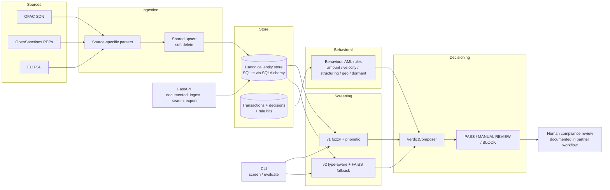
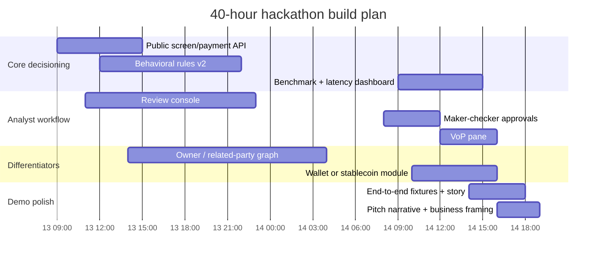

# TeslaFinTech Hackathon Project Assessment

## Executive summary

Your current project is already materially stronger than a typical hackathon prototype. The documented backend is a real compliance-oriented system with a canonical data store, ingestion pipelines for OFAC SDN, OpenSanctions PEPs, and EU FSF, two separate screening engines, a behavioral AML rules layer, a payment-level verdict composer, a vector export path, and an evaluation harness with financially relevant metrics such as F2 and MCC. Just as importantly, this architecture maps well to the actual problem definition: fast, automated payment screening that must balance false negatives against false positives and still preserve a human-review path for ambiguous cases. fileciteturn0file0 fileciteturn0file2

The main weakness is not lack of technical ambition. It is operational completeness. The documented FastAPI layer exposes ingestion, search, and export, but not a public payment-screening endpoint. The backend is also still SQLite-centric in several places, the PEP feed is capped by default unless explicitly run full-scale, and the provided materials do not document authentication, RBAC, analyst queueing, scheduled list refresh, beneficial ownership analysis, source-of-funds checks, or wallet screening. Those omissions matter because Sokin’s partner notes describe a world where suspicious transactions are reviewed by humans, account behavior matters over time, KYB ownership chains matter, and “large relative to normal,” “money in = money out,” and location anomalies are core signals. A recent AUSTRAC action against Airwallex over transaction-monitoring concerns is a reminder that these controls remain a live operational risk for cross-border payment firms, not a theoretical one. fileciteturn0file0 fileciteturn0file1 citeturn16news7

The competitor field is crowded and credible. ComplyAdvantage, HAWK, Flagright, and Napier AI are the clearest direct threats because they already market combinations of screening, transaction monitoring, explainability, and fintech or payments relevance. ComplyAdvantage is particularly dangerous because it combines a broad AML stack with a public starter plan, while HAWK and Flagright lean hard into explainable AI and payment-company workflows. Napier AI is the traditional AML-depth threat. Unit21, Feedzai, Salv, and Neterium are also important, but they are either broader, more infrastructure-led, or more specialized in adjacent operating models. citeturn10view0turn8view0turn14view0turn17view5turn12view1turn11view0turn18view0turn13view2

The best hackathon strategy is therefore **not** to position this as “yet another sanctions matcher.” The more compelling wedge is an **explainable cross-border payment decisioning copilot**: one API that combines name screening, payment-behavior anomalies, ownership/related-party risk, and analyst-ready evidence into a single decision flow. That would align far better with the partner’s stated needs, avoid a commodity fight against enterprise suites, and fit your team’s strengths in backend systems, ML, and infrastructure. The three highest-impact differentiators are: an end-to-end `/screen/payment` orchestration endpoint, an analyst review console with evidence and maker-checker flow, and a beneficial-owner or related-party graph that can turn an apparently clean company into a justified `REVIEW`. fileciteturn0file1 fileciteturn0file3 fileciteturn0file2

## Context and assumptions

I am treating `Backend.md` as the primary technical source and `mentor_answers.md` as the “report” or partner-context memo, because it contains the mentor Q&A and Sokin interview material most relevant to product fit. I also use `problem_statement.md` to anchor the target workflow and `team_and_hackathon_context.md` to constrain recommendations to what is realistic in a 40-hour, in-person build. The resulting vertical is best described as **AI-native AML, sanctions, and behavioral transaction screening for cross-border B2B payments, with optional crypto/stablecoin exposure checks**. fileciteturn0file0 fileciteturn0file1 fileciteturn0file2 fileciteturn0file3

| Assumption or missing detail | Why it matters |
|---|---|
| `mentor_answers.md` is the project “report.” fileciteturn0file1 | If you have a separate internal report with benchmark scores, user interviews, or architecture decisions, it could materially change prioritization. |
| No frontend, case-management spec, or analyst workflow API is documented. fileciteturn0file0 | UX and human-in-the-loop analysis is necessarily inferred from the partner workflow, not from implemented product surfaces. |
| No real benchmark output from `manage.py evaluate` is included. fileciteturn0file0 | The system has measurement capability, but there is no evidence yet of actual precision/recall, false-positive rate, or p95 latency. |
| No deployment manifests, tenant model, or auth/RBAC design is documented. fileciteturn0file0 | Security, data residency, and scalability conclusions are directional rather than production-certification conclusions. |
| No confirmed production integration with a bank core, case manager, KYC/KYB vendor, or blockchain intelligence feed is shown. fileciteturn0file0 | The integration analysis focuses on likely edges, not verified contracts. |

## Current solution assessment

The current backend has a sensible layered shape. Source-specific parsers ingest OFAC, OpenSanctions, and EU FSF data into a canonical entity store; screening engines load or index those entities; a separate behavioral layer scores transaction history; and a verdict composer merges “who are they?” screening with “what is happening?” behavioral detection into `BLOCK`, `MANUAL_REVIEW`, or `PASS`. That is structurally aligned with the problem statement’s three-way outcome (`MATCH`, `REVIEW`, `NO MATCH`) and with the partner’s “stop and wait” human-review model. fileciteturn0file0 fileciteturn0file2 fileciteturn0file1

The architecture also has real technical depth. Version 1 uses a weighted hybrid matcher with RapidFuzz and phonetic algorithms; version 2 adds type-aware normalization, patronym stripping, scored fallback to multilingual sentence embeddings with FAISS, and different verdict logic for sanctions versus PEP hits. The behavioral layer writes rule hits and explanations into structured decision tables, and the evaluation framework supports A/B testing with compliance-relevant metrics instead of just accuracy. That is a serious strength: many teams can build a matcher, but fewer teams can show **why** a verdict happened and **how** variants compare on a benchmark. fileciteturn0file0

The most immediate architectural problem is fragmentation. Two screening engines coexist with different thresholds and partly different semantics, while the documented HTTP layer does not expose a public screening endpoint at all. In practice, that creates three risks. First, the CLI and application may not behave identically. Second, judges or future integrators cannot easily see the whole payment-decision path through one API. Third, your strongest work is trapped inside backend internals rather than surfaced as a product. For a hackathon, that is costly, because buyers and judges want one obvious flow, not an impressive but scattered stack. fileciteturn0file0 fileciteturn0file3

The data design is strong for auditability. The system stores source provenance, lifecycle timestamps, raw parsed records, aliases, addresses, IDs, sanctions programs, and partial dates of birth. The shared upsert logic also uses soft-delete semantics instead of destructive removal, which is useful for regulated environments where you often need to explain past decisions against past list states. The vector export format is also well designed: it produces natural-language entity records suitable for downstream embedding pipelines without forcing immediate commitment to a vector database. fileciteturn0file0

Scalability is where the design is promising but not yet proven. The good news is that the stack already uses C-level fuzzy blocking, in-memory indices, and conditional vector fallback rather than blindly embedding every query. The bad news is that the canonical store is still SQLite by default, version 1 explicitly loads the watchlist into memory from raw SQLite, child rows are fully replaced during resync, and the OpenSanctions PEP ingest defaults to only 20,000 rows unless the full 1M+ feed is requested. There are also no documented latency benchmarks. This means the current design is fine for a demo and perhaps a pilot, but not yet clearly ready for production-scale, always-on, multi-tenant payments. fileciteturn0file0

Security and operational controls are thin in the documentation. Structured logging is present, and that is good for traceability, but the docs do not describe API authentication, analyst authorization, secret handling, encryption at rest, retention controls, dual-approval workflow, or a secure review queue. The logging description also says query parameters are logged, which can easily become a PII issue if payment or customer identifiers are passed as query inputs. That is especially material because partner context mentions regional regulation, multiple sign-off checks, and even UAE data-localization constraints. fileciteturn0file0 fileciteturn0file1

There is also a product-fit gap between your backend and Sokin’s stated operational pain. The partner notes say that name differences and cross-language variants are already handled by an external service, while the current backend invests heavily in internal name matching. That does not make your work wrong, but it changes its best positioning. The strongest reading is that your matcher should be pitched as a **challenger model, explainability layer, and payment-risk orchestrator**, not necessarily as a direct replacement for a production name-matching vendor. By contrast, several partner pain points are only partially covered or not covered at all: relative amount anomalies, “money in = money out,” source-of-funds evidence, beneficial ownership chains, and payee verification. fileciteturn0file1 fileciteturn0file0

The UX story is currently underbuilt. The backend produces explanations and rule hits, which is exactly what analysts need, but no analyst-facing workflow is documented. That is notable because the problem statement explicitly frames the “human in the loop” as part of the challenge, and the partner’s own process still routes suspicious transactions to compliance for approval. In other words, you already have the hard data structures for explainability; you just have not yet turned them into an obvious review experience. That is a perfect hackathon opportunity. fileciteturn0file2 fileciteturn0file1

The diagram below synthesizes the currently documented backend flow and the partner’s human-review workflow. fileciteturn0file0 fileciteturn0file1

| Strengths | Weaknesses | Opportunities | Threats |
|---|---|---|---|
| Serious backend depth for a hackathon: dual screening engines, multilingual fallback, verdict composition, export path, and benchmark harness. fileciteturn0file0 | No documented `/screen/payment` API, no analyst review UX, no published benchmark outputs, and SQLite-biased operational design. fileciteturn0file0 | Add owner-graph risk, source-of-funds evidence, VoP, analyst copilot, and wallet exposure on top of an already credible decisioning core. fileciteturn0file1 fileciteturn0file2 | Direct incumbents already sell screening + monitoring into fintechs and payment firms, including startup-accessible offers. citeturn10view0turn8view0turn14view0turn17view5 |
| Good auditability: raw record retention, structured rule hits, source-list metadata, soft deletes, and explicit explanation fields. fileciteturn0file0 | Partner-critical checks like account-baseline anomaly, money-in/money-out loops, beneficial ownership, and source-of-funds are absent or only weakly approximated. fileciteturn0file1 fileciteturn0file0 | Because partner notes suggest external name matching already exists, your best wedge is orchestration, explainability, and workflow rather than commodity matching alone. fileciteturn0file1 fileciteturn0file0 | If the pitch centers only on “better name matching,” buyers can compare you against mature vendors on a battlefield they already dominate. citeturn10view0turn12view0turn13view2 |

The table below maps the main documented capabilities to user needs and the technical debt that is most likely to matter in a hackathon demo and a follow-on pilot. fileciteturn0file0 fileciteturn0file1 fileciteturn0file2

| Capability | User or compliance need | Current value | Technical debt or missing detail |
|---|---|---|---|
| OFAC / OpenSanctions / EU FSF ingestion | Fresh sanctions and PEP coverage across major public lists | Good foundation with provenance and soft-delete lifecycle. fileciteturn0file0 | No scheduler or delta-refresh workflow is documented; PEP ingest is capped by default unless explicitly run full-feed. fileciteturn0file0 |
| v1 and v2 name screening | Catch transliterations, aliases, reordered tokens, and common-name edge cases | Stronger-than-average hackathon matching stack. fileciteturn0file0 | Coexisting engines create drift risk; no single public screening contract is documented. fileciteturn0file0 |
| PEP-aware verdict logic | Avoid auto-blocking high-risk but non-sanctioned names | Correct compliance instinct: high-confidence PEP becomes `REVIEW`, not `MATCH`. fileciteturn0file0 | No analyst workflow is documented to resolve that review path. fileciteturn0file0 fileciteturn0file1 |
| Behavioral AML rules | Detect suspicious transaction patterns, not just risky identities | Existing rules cover large amount, velocity, structuring, dormancy, and high-risk geographies. fileciteturn0file0 | Partner-requested logic such as “large relative to account average,” “money in = money out,” and richer location anomaly checks is not implemented. fileciteturn0file1 |
| VerdictComposer | Unify screening and behavioral layers into one payment decision | Strong architectural move for a judge-facing narrative. fileciteturn0file0 | No end-to-end payment API or case handoff is documented. fileciteturn0file0 |
| Rule-hit explanations and raw-record audit trail | Give compliance analysts something defensible | Strong explainability substrate already exists. fileciteturn0file0 | No analyst console, maker-checker flow, or SAR/reporting journey is documented. fileciteturn0file0 fileciteturn0file1 |
| `entity_identifications` support for wallet addresses | Future crypto/stablecoin screening | Schema already hints at wallet-aware entities. fileciteturn0file0 | No wallet-screening pipeline or graph exposure analysis is described, despite the problem statement’s crypto extension. fileciteturn0file0 fileciteturn0file2 |
| Vector export | Future RAG, semantic search, or external retrieval workflows | Good handoff point to richer evidence features. fileciteturn0file0 | Export exists, but there is no documented vector-store integration, retrieval UX, or evidence-pack flow yet. fileciteturn0file0 |

## Competitor landscape

The threat ranking below is my assessment, based on three factors: **feature overlap** with your current stack, **target-customer overlap** with cross-border payment fintechs, and **deployment maturity** visible in current product pages. The list is intentionally ordered from highest to lower threat. fileciteturn0file1 fileciteturn0file2

| Competitor | Threat | What they do and where they overlap | Where they appear strongest | Pricing model | Target customers | Likely gap you can exploit | Sources |
|---|---|---|---|---|---|---|---|
| **ComplyAdvantage** | **Very high** | Customer screening, company screening, ongoing monitoring, transaction monitoring, payment screening, sanctions/watchlists, PEPs/RCAs, adverse media. This is the closest full-stack overlap to your current direction. | Broad AML product coverage plus strong data/intelligence layer, with both enterprise motion and a startup-facing offer. | Public **Starter Plan from $99/month** for 100–2,000 monitored entities; enterprise sales-led above that. | Businesses that need screening/monitoring from startup to enterprise scale. | In reviewed pages, the value prop is broad and generic. A tighter cross-border payment workflow with ownership reasoning and analyst evidence may feel more specific and actionable. | citeturn10view0turn9view2turn9view3 |
| **HAWK** | **Very high** | Transaction monitoring, customer risk rating, AML AI overlay, investigative agent, case manager, customer screening, payment screening, and FRAML. | Explainable AI, false-positive reduction, payment-company relevance, and flexible deployment including SaaS or private cloud. | Sales-led demo flow. | Banks, payment companies, neobanks, fintechs, and crypto firms. | Strong enterprise posture can leave room for a more developer-native, faster-to-demo payment-decision product. | citeturn8view0turn15view1turn15view2turn15view4 |
| **Flagright** | **High** | Watchlist screening, transaction monitoring, risk scoring, case management, AI forensics, and fintech-oriented integrations. | API-style speed, explainable AI agents, payment/remittance/crypto focus, and clear operational metrics such as low latency and high uptime. | Sales-led demo flow; startup program also exists. | Payment processors, digital banks, banks, brokerages, crypto/stablecoin, remittances, startups, and enterprise. | In reviewed pages, the emphasis is operational workflow and configurable rules. A stronger ownership graph and richer screening science story could still differentiate you. | citeturn14view0turn14view2turn14view5turn3view5 |
| **Napier AI** | **High** | Client screening, transaction screening, transaction monitoring, perpetual client risk assessment, and modular connectivity. | Traditional AML depth, 100+ built-in AML typologies, flexible deployment, and “150+ financial institutions” credibility. | Sales-led “Book a demo.” | Banking, payments, asset and wealth management, and broader regulated institutions. | Looks heavier and more enterprise-implementation-oriented than a nimble, payment-specific hackathon wedge. | citeturn9view0turn9view1turn17view5 |
| **Unit21** | **High** | Unified AML/fraud/EDD/sanctions stack with transaction monitoring, sanction screening, customer risk rating, AI agents, graph analysis, and case-to-SAR workflows. | Connected data model, entity networks, and operations tooling. Among reviewed competitors, Unit21 comes closest to the “graph + workflow” direction you could take. | Sales-led “Get a Demo.” | Fintechs and financial institutions. | The reviewed pages show strong operations and graph workflows, but less visible differentiation in proprietary sanctions intelligence or payment-specific reviewing. | citeturn12view0turn12view1turn17view2 |
| **Feedzai** | **Medium-high** | RiskOps platform spanning fraud and financial crime, including AML transaction monitoring and watchlist screening. | Enterprise scale, network intelligence, and broad fraud/AML convergence across large financial institutions. | Sales-led “Request a Demo.” | Retail banks, merchant acquirers, PSPs, commercial banks, core banking providers, and government. | Very broad and likely heavier-weight; that creates room for a more focused product around explainable cross-border compliance decisions. | citeturn11view0turn17view3 |
| **Salv** | **Medium** | Screening, monitoring, risk scoring, and collaborative intelligence sharing via Salv Bridge. | Intelligence sharing across institutions, Europe-heavy credibility, and clear operational focus on reducing false positives and repetitive work. | Sales-led “Talk to us.” | Banks, fintechs, PSPs, and banking-as-a-service providers. | Screening-quality depth is less visible on reviewed pages than the collaboration layer. Your wedge can be stronger decision quality plus evidence depth. | citeturn18view0turn18view1turn18view3 |
| **Neterium** | **Medium** | Specialized screening infrastructure with JetScan for counterparty screening and JetFlow for scalable transaction screening, delivered as APIs. | Composable API infrastructure, high scalability claim, and connectivity to multiple leading data vendors. | API/contact-sales motion. | Banks, digital platforms, insurers, capital markets. | Narrower end-to-end story around behavioral monitoring, analyst workflow, and decision orchestration. | citeturn13view1turn13view2 |

Two additional adjacent vendors are worth watching even if I would not rank them above the eight direct threats above. **Sumsub** overlaps on watchlists/PEPs, transaction monitoring, crypto monitoring, case management, and risk scoring, but the reviewed materials still position it primarily as a unified verification and onboarding platform rather than a payment-screening specialist. **SEON** now spans customer screening, payment screening, transaction monitoring, case management, and AI-driven analysis on top of a large first-party signal graph, but its center of gravity in the reviewed materials is fraud prevention and AML command-center tooling rather than sanctions-led payment decisioning. Both matter if buyers want a single fraud-plus-compliance stack. citeturn12view5turn17view0turn19view0turn19view1turn19view2

Three competitive implications matter most for your pitch. First, **ComplyAdvantage** is the clearest startup-displacement threat because it already offers a low-friction entry price alongside broad AML capability. Second, **HAWK** is the strongest enterprise-style modern-platform threat because it combines explainable AI, payment screening, FRAML, and flexible deployment. Third, **Flagright** is probably the most dangerous “fast-moving fintech” competitor because it markets sub-second performance, startup accessibility, and regulated payments relevance all at once. That means your hackathon pitch should avoid generic “we built AML” language and instead emphasize a sharper wedge: payment-specific evidence, ownership reasoning, and human-review productivity. citeturn10view0turn15view2turn14view0turn14view5

## Hackathon roadmap

Because the event is only 40 hours, the right strategy is to build **one decisive workflow** rather than a wide compliance platform. That fits both the hackathon context and your team profile: Pavle is strongest on backend architecture, AI integration, and enough frontend to ship a UI; Dositej is the best fit for model tuning and anomaly logic; Igor is the natural owner for performance, infrastructure, and trust/security. The team-context memo also explicitly warns that your real risk is product framing and demo storytelling, not raw engineering. Partner notes reinforce the same scope principle from another angle: “do less,” ship quickly, and learn from real use. fileciteturn0file3 fileciteturn0file1

The table below is the roadmap I would use for the hackathon itself. It is intentionally biased toward features that both increase product differentiation and make the demo more tangible to judges.

| Priority | Deliverable | Time box | Suggested owner | Required tech | Demo plan | Success metric |
|---|---|---:|---|---|---|---|
| **P1** | **Public `/screen/payment` orchestration API** that accepts originator, beneficiary, country, amount, payment rail, and optional wallet/account metadata; returns verdict, confidence, matched entities, rule hits, and next action. | 6–8 hrs | Pavle + Igor | FastAPI, Pydantic, current v2 engine, VerdictComposer | Show one clean payment and one flagged payment going through a single endpoint instead of separate internal modules. | p95 sanctions-only path under **400–500 ms** on demo dataset; 100% of flagged outputs include machine-readable reasons. fileciteturn0file0 fileciteturn0file2 |
| **P1** | **Analyst review console** with queue, evidence cards, matched-name explanation, rule-hit timeline, and a simple maker-checker or “4-eyes” approval step. | 12–16 hrs | Pavle + Igor | Thin React/Lovable UI, FastAPI, SQLite/Postgres-lite session state | Turn a `REVIEW` result into a visible compliance workflow that judges can understand in 20 seconds. | 100% of `REVIEW` cases display matched tokens, source list, behavioral reason, and analyst action history. fileciteturn0file1 fileciteturn0file3 |
| **P1** | **Behavioral rules v2** for partner-specific patterns: amount-vs-account baseline, “money in = money out,” richer geo anomaly, and source-of-funds placeholder evidence. | 12–16 hrs | Dositej + Pavle | SQLAlchemy, simple statistical baselines, configurable rules | Demo a company that looks fine on name checks but gets flagged because the transaction is wildly off-pattern or ping-pongs in/out. | Catch at least 3 high-value synthetic scenarios not caught by name screening alone; keep added latency under **150 ms**. fileciteturn0file1 fileciteturn0file0 |
| **P2** | **Beneficial-owner / related-party risk graph** using a curated or public ownership sample so that a clean company can inherit review risk from an owner, director, or linked entity. | 14–18 hrs | Dositej + Igor | NetworkX or lightweight adjacency tables, cached ownership dataset, explanation layer | Demo a payment to an unsanctioned company that becomes `REVIEW` because a beneficial owner is sanctioned or PEP-linked. | At least one compelling end-to-end graph-evidence scenario; graph lookup under **300 ms** on demo set. fileciteturn0file1 fileciteturn0file2 |
| **P2** | **Verification-of-Payee pane** that compares account-holder name, instruction name, and screened entity names with explainable matching output. | 6–8 hrs | Pavle | RapidFuzz, current normalization, simple UI components | Show a payment where sanctions are clear but beneficiary-name mismatch still pushes to review. | 100% of mismatches surface top contributing tokens and mismatch reason. fileciteturn0file1 |
| **P3** | **Wallet / stablecoin exposure module** using sanctioned-wallet fixtures or a lightweight hop-based graph to flag direct or adjacent exposure. | 10–12 hrs | Igor + Dositej | Blockchain API or cached graph sample, entity/wallet normalization, optional rules | Demo why stablecoin payments into Africa need more than name checks: a wallet path with risk hops triggers review. | Directly linked sanctioned wallet = `MATCH`; one- or two-hop suspicious path = `REVIEW`; all outputs explain path. fileciteturn0file1 fileciteturn0file2 citeturn16academia8 |
| **P3** | **Benchmark and latency scoreboard** exposing current evaluation harness results, alert-rate tradeoffs, and API latency. | 6–8 hrs | Igor + Pavle | Existing evaluation framework, lightweight charts, load-test script | End the demo with evidence: “faster, fewer false positives, better analyst context.” | One dashboard showing benchmark deltas and p95 latency for the demo flow. fileciteturn0file0 |

Three differentiators stand out as the highest-impact story for judges. The first is the **owner-graph or related-party escalation layer**, because both the partner context and the problem statement highlight beneficial ownership as a real blind spot, and among the reviewed market set only Unit21 feels visibly close to this style of reasoning. The second is an **analyst copilot-style review surface**, because the partner workflow is explicitly human-in-the-loop and recent research also suggests agentic assistance is promising in AML review and adverse-media triage. The third is a **wallet/stablecoin-ready extension**, because the problem statement calls out wallet screening as a bonus path and the partner’s Africa strategy explicitly mentions stablecoins. fileciteturn0file1 fileciteturn0file2 citeturn12view0turn16academia9turn16academia8

The quickest wins are simpler. First, surface your backend through one obvious API. Second, add the missing partner-specific behavioral rules, especially “amount versus normal behavior” and in/out looping. Third, put everything behind a clean analyst queue and end the demo with benchmark numbers. Those three moves alone would make the project feel much more like a viable fintech product and much less like a backend research artifact. Recent work on temporal anomaly detection in cross-country money-transfer networks also supports the idea that relationship- and graph-aware signals can add value beyond single-transaction rules, which strengthens the case for even a lightweight ownership graph in the demo. fileciteturn0file1 fileciteturn0file0 citeturn16academia10

Just as important is what **not** to build. Do not burn hackathon time on a serious cloud migration, sharding strategy, or full Postgres replatform. The partner notes already warn that a previous horizontal-scaling effort delivered zero speedup because the bottleneck was elsewhere. For a 40-hour build, local or lightweight deployment plus great demo instrumentation is the right call. Likewise, you do not need a production vector database during the hackathon; your current FAISS path and JSONL export are enough. fileciteturn0file1 fileciteturn0file0

A clean demo flow should look like this: a low-risk payment passes instantly; a transliterated or alias-heavy beneficiary gets correctly screened; a clean company becomes `REVIEW` because a beneficial owner is high-risk; and a stablecoin or ping-pong payment gets escalated by the behavioral layer. The analyst then resolves the case with documented evidence and a maker-checker step. That tells a much better business story than “we matched names well.” fileciteturn0file1 fileciteturn0file2 fileciteturn0file3

The timeline below is an illustrative hackathon build sequence based on the June 13–14 event window. The exact clock times are less important than the sequencing and parallelization. fileciteturn0file3

## Overall judgment

The strongest honest framing is this: **you already have a credible compliance engine, but not yet a finished compliance product**. The engine is impressive. The product gap is where the hackathon should focus. The current stack already proves that the team can build serious inference, normalization, matching, and decision logic. What it does not yet prove is that a payment company could operationalize that logic quickly, trust it under review, and explain it to an analyst or regulator without extra glue. fileciteturn0file0 fileciteturn0file1

That is also why the pitch should not be “we built a better sanctions screener.” Too many mature vendors already sell that. The sharper pitch is: **we turn cross-border payment compliance into one explainable decision flow that combines identity risk, transaction behavior, ownership context, and human review without drowning operators in false positives**. That story fits the partner’s real workflow, the competitive landscape, and your team’s strengths far better than a commodity matching narrative. It is also much more likely to resonate with spectators who care about business viability, not just algorithmic cleverness. fileciteturn0file1 fileciteturn0file3 citeturn10view0turn8view0turn14view0